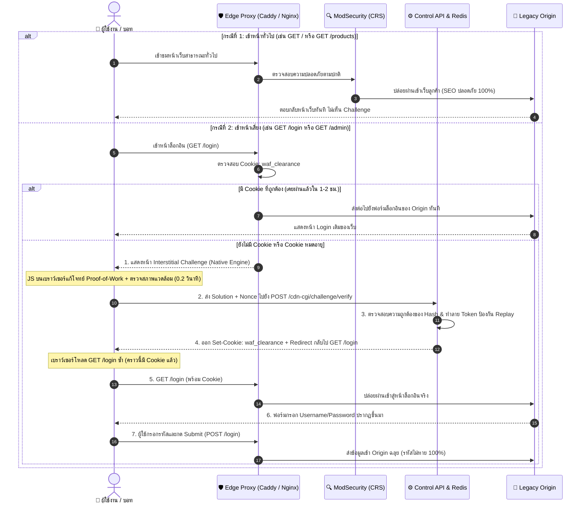

# แผนการติดตั้งระบบ Pre-Login Gate & Bot Challenge Engine
## สถาปัตยกรรม Virtual Patching สำหรับปกป้องเว็บเก่า (Legacy Origin)

> **หัวใจหลัก:** ปกป้องแอปพลิเคชันเดิมโดย **"ไม่แตะต้องโค้ด Origin แม้แต่บรรทัดเดียว"**, **"รหัสผ่าน/ฟอร์มไม่สูญหาย 100%"**, **"พัฒนา Native Challenge Engine เอง 100% ไม่พึ่งพา Cloudflare"** และ **"เปิดใช้งานได้ทันทีจาก Dashboard (Plug-and-Play)"**

---

## 1. บทสรุปสถาปัตยกรรม (Executive Summary)

จากการวิเคราะห์เปรียบเทียบระหว่างการพึ่งพา Cloudflare กับการสร้างระบบขึ้นมาเอง เราเลือกใช้สถาปัตยกรรม **"Pluggable Dual-Engine"** โดยมี **Native In-House Engine เป็นค่าเริ่มต้นหลัก**:

1. **Native In-House Challenge Engine (ระบบหลัก — สร้างเอง 100%):**
   * **เอกเทศและปลอดภัย (Data Sovereignty & PDPA):** ข้อมูลทราฟฟิกและ IP อยู่บนเซิร์ฟเวอร์ของเรา (VPS) 100% ไม่ถูกส่งออกนอกประเทศ
   * **Zero External Dependency:** ไม่ต้องสมัครบัญชีภายนอก ไม่ต้องขอ Key และระบบไม่ล่มตาม Third-party
   * **ทำงานเงียบ (Lightweight JS & Proof-of-Work):** สกัดกั้นบอทสแกนและสคริปต์ยิงรหัสผ่าน (sqlmap, Hydra, Python `requests`, `curl`) ได้ 99% เพราะเครื่องมือเหล่านี้รัน JavaScript ไม่ได้ ในขณะที่คนจริงผ่านฉลุยใน 0.2 วินาที
2. **Pre-Login Gate (ด่านหน้าล็อกอิน):**
   * บังคับใช้ Challenge ที่เส้นทางเข้าสู่ระบบโดยเฉพาะ (เช่น `GET /login`, `GET /admin`, `GET /wp-login.php`)
   * **ตัดปัญหาฟอร์มหลุด (Zero Data Loss):** ดักตั้งแต่ตอนเปิดเข้ามาดูหน้าเว็บ (`GET`) ก่อนที่ผู้ใช้จะได้กรอกรหัสผ่าน เมื่อผ่านการตรวจสอบแล้วถึงจะแสดงฟอร์มจริง เมื่อกด Submit (`POST`) จะมีคุกกี้แล้ว วิ่งเข้า Origin ทันที
3. **Public Browsing Protection (หน้าเนื้อหาทั่วไป):**
   * หน้าทั่วไป (`/`, `/products`, `/articles`) **ไม่มีการขึ้น Challenge กวนใจคนปกติ และไม่กระทบ Googlebot (SEO ปลอดภัย 100%)**
   * ปล่อยให้ **ModSecurity CRS** คอยตรวจจับเงียบๆ หากมีแฮกเกอร์ยิง SQL Injection หรือ XSS เข้ามา WAF จะตัดบทบล็อก 403 ทันที
4. **Cloudflare Turnstile Adapter (ตัวเลือกเสริม):**
   * ระบบรองรับการเสียบ Turnstile Key เพิ่มเติมได้ สำหรับลูกค้าระดับองค์กรที่ต้องการใช้ Global Threat Intel ของ Cloudflare ควบคู่กัน

---

## 2. แผนผังการทำงาน (Detailed Request Lifecycle)



---

## 3. การแก้ปัญหาและบั๊กแฝงจากการทำระบบเอง (Self-Built Engine Pitfalls & Countermeasures)

การทำ Bot Challenge Engine ขึ้นมาเองต้องรับมือกับกับดักทางเทคนิค 5 ข้อสำคัญ ดังนี้:

| จุดเสี่ยง / บั๊กที่อาจพบ | ผลกระทบที่อาจเกิด | วิธีการแก้ปัญหาเชิงลึกในสถาปัตยกรรมนี้ |
| :--- | :--- | :--- |
| **1. มือถือเก่าเครื่องค้างจาก PoW** | ถ้าตั้งโจทย์คำนวณ Hash ยากเกินไป มือถือสเปกต่ำจะค้างหรือกินแบต | **Lightweight Difficulty:** ตั้งความยากระดับเบามาก (เช่น หา Hash ที่ขึ้นต้นด้วย `000` ใช้เวลาราว 0.05-0.1 วิ) บังคับแค่ให้ต้องมี JS Runtime ไม่เผา CPU |
| **2. In-App Browser ใน LINE/FB พัง** | WebView ของแอปแชทบางรุ่นไม่รองรับ Web Crypto API (`crypto.subtle`) ทำให้หน้าเว็บ Error ค้าง | **Dual Hash Fallback:** เขียนโค้ด Pure JS Vanilla SHA-256 สำรองไว้ หากตรวจพบว่าเบราว์เซอร์ไม่มี `window.crypto.subtle` ให้สลับไปใช้ฟังก์ชันสำรองทันที |
| **3. การโจมตีแบบส่งคำตอบซ้ำ (Replay)** | บอทแก้โจทย์รอบเดียว แล้วส่งคำตอบเดิมซ้ำเป็นพันครั้งเพื่อปั๊มคุกกี้ | **Single-Use Challenge Token:** Control API เจน `challenge_id` สุ่มเก็บใน Redis อายุ 60 วินาที เมื่อถูก verify แล้วจะลบทิ้งทันที คำตอบเดิมใช้ซ้ำไม่ได้ |
| **4. Verification Endpoint โดน DoS** | แฮกเกอร์เปลี่ยนเป้าหมายมายิงถล่ม `POST /cdn-cgi/challenge/verify` จนระบบล่ม | **Strict Path Rate-Limit:** จำกัด Rate Limit ที่ Endpoint นี้ไม่เกิน 10 ครั้ง/นาที ต่อ IP หากยิงรัวจะติดบล็อก 429 ทันที |
| **5. บอทสวมรอยเบราว์เซอร์ (Stealth)** | บอทขั้นสูง (Puppeteer Stealth) สามารถปลอมค่า `navigator.webdriver` ได้ | **Multi-Signal Detection:** ตรวจสอบหลายสัญญาณประกอบกัน (Canvas Fingerprint, Screen Width/Height, AudioContext) ร่วมกับ ModSecurity CRS Score |

---

## 4. ข้อกำหนดทางเทคนิค (Technical Specifications)

### 4.1 กลไก Native Proof-of-Work (PoW)
1. เมื่อเปิดหน้า Challenge ตัวหน้าเว็บจะได้รับ Payload:
   ```json
   {
     "challenge_id": "c8f9b012-3456-4abc-def0-1234567890ab",
     "prefix": "waf-salt-2026",
     "difficulty": 3
   }
   ```
2. โค้ด JavaScript ในเบราว์เซอร์จะวนลูปหาตัวเลข `nonce` ที่ทำให้:
   $$\text{SHA-256}(\text{prefix} + \text{nonce}) \text{ ขึ้นต้นด้วย } "000"$$
3. สคริปต์ส่งคำตอบกลับมา:
   ```json
   {
     "challenge_id": "c8f9b012-3456-4abc-def0-1234567890ab",
     "nonce": 4218,
     "host": "customer-origin.com"
   }
   ```
4. Control API ตรวจสอบว่า `challenge_id` มีอยู่ใน Redis หรือไม่ และ Hash ตรงจริงหรือไม่ ก่อนออกคุกกี้

### 4.2 รูปแบบและโครงสร้างของ Clearance Cookie
* **Cookie Name:** `waf_clearance`
* **Attributes:** `Path=/; Secure; HttpOnly; SameSite=Lax; Max-Age=3600` (จำไว้ 1 ชั่วโมง)
* **Payload โครงสร้าง:**
  ```
  <EXPIRE_TIMESTAMP>.<HOST_NAME>.<HMAC_SIGNATURE>
  ```
* **สูตรการคำนวณ HMAC-SHA256:**
  $$\text{Signature} = \text{HMAC-SHA256}(\text{IP\_Subnet (/24)} + \text{UserAgent} + \text{Host} + \text{ExpireTimestamp}, \text{SECRET\_KEY})$$
  *(ผูกกับ Subnet `/24` เพื่อไม่ให้ผู้ใช้เน็ตมือถือ 4G/5G หลุดลูปเวลาสลับเสาสัญญาณ)*

---

## 5. การออกแบบ Dashboard UI/UX: เมนูและการควบคุม

### 5.1 ตัวเลือกและการทำงานใน Dashboard (`OriginDetail.tsx`)
เมนูจะถูกจัดวางในแท็บ **"Bot & Login Shield (Virtual Patching)"** โดยมีค่าเริ่มต้นเป็น **Native Engine**:

| การตั้งค่า | ค่าเริ่มต้น (Default) | คำอธิบาย |
| :--- | :---: | :--- |
| **สถานะการป้องกัน (Enable)** | `OFF` | สวิตช์หลักสำหรับเปิดใช้ระบบดักจับหน้าล็อกอิน |
| **Engine ที่ใช้งาน** | `Native In-House Engine (แนะนำ)` | • **Native (Default):** ทำงานเงียบ ข้อมูลอยู่ในระบบ 100% ไม่พึ่งบุคคลที่สาม<br>• **Cloudflare Turnstile:** โหมดใช้ Turnstile สำหรับผู้ที่ต้องการ |
| **เส้นทางล็อกอิน (Login Paths)** | 5 Paths มาตรฐาน | `["/login*", "/admin*", "/wp-login.php", "/administrator*", "/user/login*"]` |
| **IP ออฟฟิศยกเว้น (IP Bypass)** | ว่างเปล่า `[ ]` | อนุญาตให้พนักงานในบริษัทเข้าหน้าล็อกอินได้เลย ไม่ต้องผ่านด่าน Challenge |
| **อายุการจำสิทธิ์ (Clearance TTL)** | `1 ชั่วโมง` (3600 วิ) | ระยะเวลาที่ผู้ใช้ไม่ต้องเจอด่าน Challenge ซ้ำ |

---

### 5.2 ตัวอย่างหน้าตา Dashboard UI

```text
+-------------------------------------------------------------------------------+
|  🛡️  Bot & Login Protection (Virtual Patching Shield)                         |
|  ระบบคัดกรองบอทและป้องกันการสุ่มรหัสผ่านหน้าล็อกอินโดยไม่แตะโค้ดเดิม              |
+-------------------------------------------------------------------------------+
|                                                                               |
|  สถานะการป้องกัน:  [  🟢 เปิดใช้งานอยู่ (Active)  ]  (Toggle Switch)            |
|                                                                               |
|  กลไกการตรวจจับ (Challenge Engine):                                           |
|  (●) Native In-House Engine (แนะนำ - ทำงานเงียบ ข้อมูลอยู่ในระบบ 100%)             |
|  ( ) Cloudflare Turnstile Adapter (ต้องระบุ Site Key / Secret Key)            |
|                                                                               |
|  ▾ การตั้งค่าขั้นสูง (Advanced Settings - ตัวเลือกเสริม)                          |
|  ---------------------------------------------------------------------------  |
|  1. เส้นทางที่ต้องการป้องกัน (Login Paths):                                     |
|     [ /admin*, /login*, /wp-login.php                                    ]    |
|                                                                               |
|  2. IP ออฟฟิศที่อนุญาตให้ผ่านได้ทันที (Bypass Whitelist):                           |
|     [ 203.144.12.50, 110.168.0.0/24                                      ]    |
|                                                                               |
|  3. ระยะเวลาจำการยืนยัน (Session Clearance):                                    |
|     [ 1 ชั่วโมง (แนะนำ)   ▼ ]                                                  |
|  ---------------------------------------------------------------------------  |
|  [ บันทึกการเปลี่ยนแปลง (Save) ]                                               |
+-------------------------------------------------------------------------------+
```

---

## 6. สคีมาข้อมูลใน Redis (Data Schema)

```json
{
  "origin_id": "origin-legacy-dvwa",
  "domain": "dvwa.example.com",
  "captcha_shield": {
    "enabled": true,
    "engine": "native",
    "login_paths": [
      "/login.php",
      "/admin"
    ],
    "clearance_ttl": 3600,
    "bypass_ips": [
      "203.0.113.100"
    ],
    "pow_difficulty": 3,
    "created_at": "2026-09-09T18:20:00Z"
  }
}
```

---

## 7. แผนการ Rollout แบบ 4 ขั้นตอน (Zero-Friction Phased Rollout)

1. **Phase 1 (Core Engine):** พัฒนาหน้า `challenge.html` แบบ Native JS PoW + Endpoint `/cdn-cgi/challenge/verify` ใน `waf-control-api`
2. **Phase 2 (Dashboard & Config):** เพิ่ม UI Toggle ใน `OriginDetail.tsx` และเก็บสถานะลง Redis
3. **Phase 3 (Internal Pilot):** ทดสอบกับโดเมนทดลอง (DVWA) ยืนยันว่าคนจริงผ่านใน 0.2 วินาที และสคริปต์ Python โดนสกัด 100%
4. **Phase 4 (Production Deployment):** เปิดให้ใช้งานสำหรับเว็บลูกค้าจริง

---

## 8. สรุปคุณค่าที่เหนือกว่า (Value Proposition)

1. **เป็นเจ้าของเทคโนโลยี 100%:** แพลตฟอร์มของเราไม่ต้องพึ่งพา Cloudflare หรือ Third-party ใดๆ เลย
2. **Data Sovereignty & PDPA:** มั่นใจได้ 100% ว่าไม่มีข้อมูลผู้ใช้ไทยหลุดออกไปเซิร์ฟเวอร์ต่างประเทศ
3. **Zero Origin Touch & Zero Data Loss:** เว็บเดิมไม่ต้องแก้โค้ด และรหัสผ่านที่กรอกไม่สูญหายด้วย Pre-Login Gate
4. **สกัดกั้นบอทสุ่มรหัสผ่านได้จริง 99%:** หยุดเครื่องมือสแกนเนอร์และบอทสคริปต์ทุกประเภทก่อนถึงเว็บลูกค้า

---

## 9. สถานะการดำเนินงานล่าสุด (อัปเดต 2026-09-09)

### 9.1 ทำเสร็จแล้ว

- ข้าม P0 ตามคำสั่ง: **ยังไม่ได้ปิดหรือจำกัด port 8080**
- สร้าง Native In-House CAPTCHA Engine ใน `cdn/control-api/captcha_engine.py`
  - Native JS SHA-256 Proof-of-Work challenge
  - Redis single-use challenge TTL 60 วินาที
  - Clearance cookie `waf_clearance` แบบ HMAC ผูกกับ host, client subnet, User-Agent และ expiry
  - Cookie เป็น `Secure`, `HttpOnly`, `SameSite=Lax`
  - Verify rate limit 10 ครั้ง/นาที/IP
  - ค่าเริ่มต้น clearance TTL 3600 วินาที และ PoW difficulty 3
- เชื่อม Nginx แบบ pre-login gate โดยตรวจเฉพาะ GET/HEAD ตาม login paths; POST/JSON/AJAX ไม่ถูก challenge
- คง rate-limit เดิมไว้ใน auth chain และให้ CAPTCHA fail-open เมื่อ config/service ภายนอกใช้งานไม่ได้
- เพิ่ม Safe Zone `/cdn-cgi/*` และ route challenge/verify ไปยัง `control-api` ผ่าน Docker network
- เพิ่ม Redis config API สำหรับ Origin ใน Dashboard backend ที่ `GET/PUT /api/origins/{origin_id}/captcha`
- เพิ่มการ sync config ไปยังโดเมนที่ DNS verified และตั้งค่าเริ่มต้นเป็น `enabled=false`
- เพิ่ม Redis dependency, Nginx include mount และ `captcha_engine.py` เข้า control-api image
- ใช้ secret แบบคงที่ผ่าน `CAPTCHA_HMAC_SECRET` หรือ fallback เป็น `CONTROL_TOKEN` เพื่อไม่ให้ cookie clearance หายเมื่อ service restart
- ทำ backup ก่อนแก้ไขไว้ที่ `/root/waf_project_backup_safe/`

### 9.2 ผลการตรวจสอบล่าสุด

- `python3 -m py_compile`: ผ่านทั้ง control-api และ Dashboard backend
- `docker compose config`: ผ่าน
- `docker compose build control-api`: ผ่าน
- `nginx -t`: ผ่านทั้ง temporary validation container และ `waf-nginx` ที่ใช้งานจริง
- `control-api /healthz`: HTTP 200
- Dashboard service `waf-dashboard.service`: active และ `/health`: HTTP 200
- CAPTCHA disabled access: HTTP 204
- Synthetic enabled challenge ผ่าน Nginx: HTTP 200 HTML
- Synthetic GET target ถูกส่งเข้า challenge และ POST target ไม่ถูก challenge
- ลบ Redis test key แล้ว และ production domains ยังไม่ได้เปิด CAPTCHA

### 9.3 ยังไม่ทำ / ขั้นตอนถัดไป

- ยังไม่ได้เพิ่ม UI Toggle และ Advanced Settings ใน `OriginDetail.tsx`
- ยังไม่ได้พัฒนา Cloudflare Turnstile Adapter (เป็น optional phase)
- ยังไม่ได้ทำ Phase 3 internal pilot หรือ Phase 4 production rollout
- ก่อนเปิดใช้งานจริงต้องกำหนด `CAPTCHA_HMAC_SECRET` เป็น secret แบบถาวร และทดสอบกับโดเมน pilot ก่อน

**สถานะปัจจุบัน:** Native CAPTCHA enforcement พร้อมใช้งานในระบบ แต่ปิดไว้ทุกโดเมนเพื่อรอ Dashboard UI และการ pilot อย่างเป็นขั้นตอน
