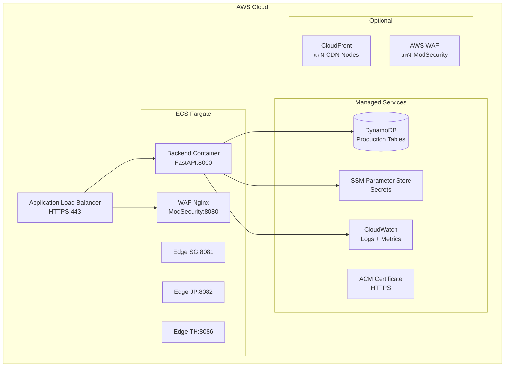

# 🛡️ WAF Project — System Review & Cloud Readiness Assessment

> **Reviewed by:** Claude Opus 4.6 (Thinking)  
> **Review Date:** 2026-07-06  
> **Scope:** Full-stack review — Backend (FastAPI), Frontend (React+Vite), Infrastructure (Docker/ModSecurity/CDN), Security, Cloud Readiness  
> **Files Reviewed:** 50+ files across all layers

---

## 📋 สารบัญ (Table of Contents)

1. [สรุปภาพรวม (Executive Summary)](#1-สรุปภาพรวม)
2. [ขั้นตอนการเทสที่ทำ (Testing Steps Performed)](#2-ขั้นตอนการเทสที่ทำ)
3. [สิ่งที่ทำได้ดี (What's Done Well)](#3-สิ่งที่ทำได้ดี)
4. [จุดที่ยังขาด — Pre-Production (Gaps)](#4-จุดที่ยังขาด--pre-production)
5. [จุดที่เกินหรือควรปรับ (Excessive/Needs Refactor)](#5-จุดที่เกินหรือควรปรับ)
6. [Production Readiness Checklist](#6-production-readiness-checklist)
7. [ขั้นตอนการขึ้น Cloud (Cloud Deployment Steps)](#7-ขั้นตอนการขึ้น-cloud)
8. [Security Audit Summary](#8-security-audit-summary)
9. [Action Items สรุป (Priority Matrix)](#9-action-items-สรุป)

---

## 1. สรุปภาพรวม

### Architecture Score Card

| ด้าน | Status | Score | หมายเหตุ |
|------|--------|-------|----------|
| **Functionality** | ✅ ครบ feature | 8/10 | ครบทุก feature ที่วางไว้ |
| **Security** | ⚠️ ดีแต่ยังมีจุดเสี่ยง | 6/10 | Secrets ใน `.env` ถูก commit, ขาด CSRF token |
| **Code Quality** | ✅ ดี | 7/10 | มี type safety, modular, มี error handling |
| **Test Coverage** | ❌ ขาด | 3/10 | มี integration test แค่ 2 ไฟล์, ไม่มี unit test |
| **Cloud Readiness** | ⚠️ ต้องปรับ | 4/10 | ยังผูกกับ localhost, ไม่มี Dockerfile สำหรับ backend |
| **Observability** | ❌ ขาด | 2/10 | ไม่มี structured logging, metrics, APM |
| **CI/CD** | ❌ ไม่มี | 0/10 | ไม่มี pipeline, automated tests, deployment scripts |
| **Documentation** | ✅ ดี | 7/10 | README ดี, มี DESIGN.md ครบ |

**Overall: 5.5/10 — ระบบทำงานได้ดีใน Dev แต่ยังไม่พร้อม Production**

---

## 2. ขั้นตอนการเทสที่ทำ

### 2.1 Static Code Review (ทำแล้ว ✅)

ผมอ่านทุกไฟล์ต่อไปนี้แบบละเอียด:

#### Backend (13 ไฟล์)
| ไฟล์ | เนื้อหาที่ตรวจ |
|------|-------------|
| `dashboard/backend/main.py` | App entry, CORS, middleware, static files, background tasks |
| `dashboard/backend/api/auth.py` | Register, Login, Google OAuth, Telegram auth, role management |
| `dashboard/backend/api/cdn.py` | CDN nodes, stats, purge, latency, logs endpoints |
| `dashboard/backend/api/alerts.py` | Telegram pairing flow, alert polling, cleanup tasks |
| `dashboard/backend/api/rules.py` | ModSecurity rule CRUD |
| `dashboard/backend/services/auth_service.py` | Password hashing (Argon2), JWT, Google OAuth, user CRUD |
| `dashboard/backend/services/dynamodb_service.py` | DynamoDB operations, log/alert storage |
| `dashboard/backend/services/rbac.py` | Role-based access control, token extraction |
| `dashboard/backend/services/log_forward.py` | Nginx/ModSec log tailing & merge logic |
| `dashboard/backend/services/cdn_log_forward.py` | CDN access log forwarding |
| `dashboard/backend/services/telegram_listener.py` | Telegram alert worker with cache |
| `dashboard/backend/services/rule_manager.py` | ModSecurity rule file management, nginx reload |
| `dashboard/backend/services/rate_limiter.py` | Rate limiting config |

#### Frontend (20+ ไฟล์)
| ไฟล์ | เนื้อหาที่ตรวจ |
|------|-------------|
| `dashboard/frontend/src/App.tsx` | Router, protected routes, admin routes |
| `dashboard/frontend/src/api/axios.ts` | Axios config, interceptors |
| `dashboard/frontend/src/store/authStore.ts` | Zustand auth state |
| `dashboard/frontend/src/types/index.ts` | TypeScript type definitions |
| `dashboard/frontend/src/pages/*.tsx` | ทุกหน้า 9 pages |
| `dashboard/frontend/src/components/**/*` | ทุก component (ui, layout) |
| `dashboard/frontend/vite.config.ts` | Build config, proxy |
| `dashboard/frontend/package.json` | Dependencies |

#### Infrastructure (5+ ไฟล์)
| ไฟล์ | เนื้อหาที่ตรวจ |
|------|-------------|
| `docker-compose.yml` | WAF + DVWA containers |
| `cdn/docker-compose-cdn.yml` | CDN edge nodes (SG/JP/TH), GeoDNS, Purge API, Stats |
| `nginx/nginx.conf.template` | Nginx config template |
| `modsecurity/setup.conf` | ModSecurity rule loading |
| `.env` / `.env.example` | Environment config |
| `.gitignore` | File exclusion rules |

---

### 2.2 ขั้นตอนเทสที่แนะนำให้ลองทำตาม (Manual Testing Steps)

#### Test 1: Backend Health Check
```bash
# 1. Start backend
cd dashboard/backend
source .venv/bin/activate
python main.py

# 2. Test health endpoint (ไม่ต้อง auth)
curl http://localhost:8000/api/health

# Expected: {"status": "ok", "dynamodb": "connected"}
# หรือ {"status": "error", "dynamodb": "..."} — ถ้า DynamoDB ยังไม่ connect
```

#### Test 2: User Registration & Login Flow
```bash
# 3. Register user (คนแรกจะได้ admin อัตโนมัติ)
curl -X POST http://localhost:8000/api/auth/register \
  -H "Content-Type: application/json" \
  -d '{"email": "test@example.com", "username": "testuser", "password": "Password123!"}'

# Expected: {"access_token": "...", "token_type": "bearer", "user": {..., "role": "admin"}}

# 4. Login
curl -X POST http://localhost:8000/api/auth/login \
  -H "Content-Type: application/json" \
  -d '{"email": "test@example.com", "password": "Password123!"}'

# Expected: {"access_token": "...", ...}
# เก็บ token ไว้ใช้
TOKEN="<paste_token_here>"
```

#### Test 3: Protected API Endpoints
```bash
# 5. Get current user
curl http://localhost:8000/api/auth/me -H "Authorization: Bearer $TOKEN"

# 6. System info
curl http://localhost:8000/api/system/info -H "Authorization: Bearer $TOKEN"

# 7. Get logs
curl "http://localhost:8000/api/logs/recent?limit=5" -H "Authorization: Bearer $TOKEN"

# 8. Get rules
curl http://localhost:8000/api/rules/ -H "Authorization: Bearer $TOKEN"

# 9. Get alerts
curl "http://localhost:8000/api/alerts/recent?limit=5" -H "Authorization: Bearer $TOKEN"
```

#### Test 4: CDN API Endpoints
```bash
# 10. CDN nodes (ต้อง start CDN stack ก่อนถึงจะเห็น online)
curl http://localhost:8000/api/cdn/nodes -H "Authorization: Bearer $TOKEN"

# 11. CDN stats (จะ fallback เป็น mock data ถ้า stats service ยังไม่รัน)
curl http://localhost:8000/api/cdn/stats -H "Authorization: Bearer $TOKEN"

# 12. CDN logs
curl "http://localhost:8000/api/cdn/logs?region=ALL&limit=5" -H "Authorization: Bearer $TOKEN"

# 13. CDN latency
curl "http://localhost:8000/api/cdn/latency?region=ALL" -H "Authorization: Bearer $TOKEN"
```

#### Test 5: Rate Limiting
```bash
# 14. Brute force test (login limit = 5/minute)
for i in {1..6}; do
  echo "Request $i:"
  curl -s -o /dev/null -w "%{http_code}" -X POST http://localhost:8000/api/auth/login \
    -H "Content-Type: application/json" \
    -d '{"email": "dummy@x.com", "password": "wrong"}'
  echo ""
done
# Expected: 401, 401, 401, 401, 401, 429 (rate limited)
```

#### Test 6: Frontend Build & Run
```bash
# 15. Frontend dev mode
cd dashboard/frontend
npm install
npm run dev
# เปิด http://localhost:5173

# 16. Frontend production build
npm run build
# ตรวจว่า dist/ ถูกสร้างเรียบร้อย
ls dist/
```

#### Test 7: Docker Infrastructure
```bash
# 17. WAF stack
cd /path/to/waf_project
docker compose up -d
docker compose ps

# 18. CDN stack
cd cdn
docker compose -f docker-compose-cdn.yml up -d --build
docker compose -f docker-compose-cdn.yml ps

# 19. Test WAF proxy
curl -v http://localhost:8080/
# Expected: DVWA page

# 20. Test WAF blocking (SQL injection)
curl "http://localhost:8080/?q=SELECT%20*%20FROM%20users"
# Expected: 403 Forbidden

# 21. CDN edge health
curl http://localhost:8081/healthz  # SG
curl http://localhost:8082/healthz  # JP
curl http://localhost:8086/healthz  # TH
```

#### Test 8: Google OAuth Flow
```bash
# 22. เปิด browser ไปที่:
# http://localhost:8000/api/auth/google
# ควร redirect ไป Google consent screen
# หลัง consent ควร redirect กลับมาที่ /oauth-success
```

#### Test 9: RBAC Test
```bash
# 23. Register user ที่สอง (จะได้ role viewer)
curl -X POST http://localhost:8000/api/auth/register \
  -H "Content-Type: application/json" \
  -d '{"email": "viewer@example.com", "username": "viewer", "password": "Password123!"}'

VIEWER_TOKEN="<paste_token>"

# 24. ลองใช้ viewer เข้า admin-only endpoint
curl http://localhost:8000/api/auth/users -H "Authorization: Bearer $VIEWER_TOKEN"
# Expected: 403 Forbidden
```

#### Test 10: Telegram Alert Integration
```bash
# 25. Check Telegram connect status
curl http://localhost:8000/api/alerts/connect/status -H "Authorization: Bearer $TOKEN"

# 26. Start pairing
curl -X POST http://localhost:8000/api/alerts/connect/start -H "Authorization: Bearer $TOKEN"
# Expected: {"code": "XXXXXX", "bot_username": "...", "expires_in": 300}
```

---

## 3. สิ่งที่ทำได้ดี

### ✅ Architecture & Design
- **Modular structure**: แยก API routes, services, components ชัดเจน
- **TypeScript types**: มี type definitions ครบทุก entity
- **React Query**: ใช้ polling-based real-time data ได้ดี
- **Zustand + persist**: State management ที่เบาและ persist ข้าม session ได้

### ✅ Security (จุดที่ดี)
- **Argon2 password hashing**: ดีกว่า bcrypt ในแง่ resistance ต่อ GPU attacks
- **JWT + HttpOnly Cookie**: ใช้ dual auth ได้ถูกต้อง (Bearer header + cookie)
- **CORS explicit origins**: ไม่ใช้ `allow_origins=["*"]` กับ `credentials=True`
- **Rate limiting**: มี slowapi ป้องกัน brute force
- **Command whitelist**: `rule_manager.py` มี whitelist สำหรับ nginx commands
- **GSI fallback**: `auth_service.py` fallback จาก GSI query → scan ถ้า index ยังไม่มี

### ✅ CDN Architecture
- **Multi-region edge nodes**: SG/JP/TH ด้วย ModSecurity CRS
- **Health checks**: Docker healthcheck ใน compose
- **GeoDNS simulation**: มี DNS-based routing
- **Cache purge API**: มี purge mechanism ครบ
- **Rule sync**: มี mechanism sync rules จาก control-api ไปยัง edge nodes

### ✅ Log Pipeline
- **Dual source merge**: ผสม nginx access log + ModSecurity audit log ด้วย request_id
- **Fallback flush**: มี timeout-based flush สำหรับ unpaired logs
- **CDN log forward**: แยก CDN logs ออกจาก WAF logs ด้วย `source=cdn`

---

## 4. จุดที่ยังขาด — Pre-Production

### 🔴 Critical (ต้องแก้ก่อน deploy)

#### C1: Secrets ถูก commit ลง Git
```
ปัญหา: ไฟล์ .env มี real credentials (AWS keys, JWT secret, Telegram tokens, Google OAuth)
         แม้ .gitignore จะมี .env แต่ไฟล์นี้อาจถูก commit ไปแล้วใน history
ไฟล์: .env (line 1-17)
```
**แก้ไข:**
1. ลบ `.env` ออกจาก git history: `git filter-repo --path .env --invert-paths`
2. Rotate ทุก credential ที่ถูก expose (AWS keys, JWT secret, etc.)
3. ใช้ AWS Secrets Manager / Parameter Store แทน `.env` ใน production

---

#### C2: ไม่มี Dockerfile สำหรับ Backend
```
ปัญหา: Backend (FastAPI) รัน native ด้วย python/uvicorn
         ไม่มี Dockerfile สำหรับ containerize
         ไม่สามารถ deploy เป็น container ไปยัง cloud ได้
```
**แก้ไข:** สร้าง `dashboard/backend/Dockerfile`:
```dockerfile
FROM python:3.11-slim
WORKDIR /app
COPY requirements.txt .
RUN pip install --no-cache-dir -r requirements.txt
COPY . .
CMD ["uvicorn", "main:app", "--host", "0.0.0.0", "--port", "8000"]
```

---

#### C3: ไม่มี Dockerfile สำหรับ Frontend (Production)
```
ปัญหา: Frontend ต้อง npm run build แล้วให้ backend serve
         ไม่มี multi-stage Dockerfile สำหรับ build + serve
```
**แก้ไข:** สร้าง multi-stage build ที่ build React แล้วคัดลอก dist ไปใน backend image

---

#### C4: Login API ส่ง body เป็น JSON แต่ Frontend ส่ง form-urlencoded
```
ปัญหา: Backend api/auth.py POST /login รับ Pydantic model (JSON body)
         แต่ Frontend api/auth.ts ส่ง URLSearchParams ด้วย key "username" แทน "email"
ไฟล์: dashboard/frontend/src/api/auth.ts (line 7-13)
       dashboard/backend/api/auth.py (line 91-93)
```
**สถานะ:** ⚠️ ต้องทดสอบว่า FastAPI parse ได้ถูกต้องหรือไม่ — อาจ work ถ้า FastAPI auto-parse body
แต่ field name mismatch (`username` vs `email`) จะทำให้ login ล้มเหลว

**แก้ไข:** Frontend ควรส่ง JSON body ตรงกับ `LoginRequest` schema:
```typescript
const res = await api.post('/auth/login', { email, password })
```

---

#### C5: ไม่มี CSRF Protection
```
ปัญหา: ใช้ cookie-based auth แต่ไม่มี CSRF token
         Cross-site request สามารถใช้ cookie ที่ login แล้ว submit POST ได้
         โดยเฉพาะ Google OAuth callback ที่ set cookie แล้ว redirect
```
**แก้ไข:** 
- เพิ่ม CSRF middleware (เช่น `starlette-csrf`)
- หรือใช้ `SameSite=strict` สำหรับ auth cookie

---

#### C6: `datetime.utcnow()` ถูก deprecate ใน Python 3.12+
```
ปัญหา: ใช้ datetime.utcnow() ซึ่ง deprecated ตั้งแต่ Python 3.12
ไฟล์: auth_service.py, log_forward.py, cdn_log_forward.py, dynamodb_service.py
```
**แก้ไข:** ใช้ `datetime.now(datetime.UTC)` แทน

---

### 🟡 Important (ควรแก้ก่อน Pre-Production)

#### I1: ไม่มี Automated Tests
```
ปัญหา: มี test script แค่ 2 ไฟล์ (scripts/test_integration.py, test_cdn_logs.py)
         ไม่มี pytest framework, ไม่มี unit tests, ไม่มี frontend tests
         ไม่มี CI/CD pipeline
```

**แก้ไข:**
1. ตั้ง pytest + fixtures สำหรับ backend
2. เพิ่ม unit tests สำหรับ: auth, rbac, rule_manager, dynamodb_service
3. เพิ่ม API integration tests ด้วย httpx.AsyncClient + TestClient
4. Frontend: เพิ่ม Vitest + React Testing Library

---

#### I2: DynamoDB Scan ที่ไม่ Scale
```
ปัญหา: หลาย endpoint ใช้ table.scan() ซึ่ง scan ทั้งตาราง
         - get_logs() → scan ทั้ง waf_logs
         - get_cdn_logs() → scan with filter
         - list_users() → scan ทั้ง waf_users
         - get_unalerted_403_logs() → scan with filter
         เมื่อข้อมูลโตขึ้น จะช้ามากและเสีย RCU มาก
ไฟล์: dynamodb_service.py (line 63-69, 71-90, 183-189)
```
**แก้ไข:**
1. สร้าง GSI สำหรับ waf_logs: `source-timestamp-index` (source เป็น PK, timestamp เป็น SK)
2. ใช้ Query แทน Scan ทุกที่ที่เป็นไปได้
3. เพิ่ม TTL สำหรับ waf_logs เพื่อ auto-delete logs เก่า

---

#### I3: ไม่มี Pagination จริง ใน Backend
```
ปัญหา: API logs/alerts ใช้ Limit ของ DynamoDB scan ซึ่งไม่ใช่ true pagination
         DynamoDB Limit จำกัดจำนวน items ที่ evaluate ไม่ใช่ผลลัพธ์หลัง filter
         Frontend Logs page ไม่มี pagination component
ไฟล์: dynamodb_service.py, api/alerts.py
```
**แก้ไข:** Implement cursor-based pagination ด้วย `LastEvaluatedKey`

---

#### I4: ไม่มี Logging Framework ที่ถูกต้อง
```
ปัญหา: ส่วนใหญ่ใช้ print() แทน logging
         ไม่มี structured logging (JSON format)
         ไม่มี log levels ที่สม่ำเสมอ
ไฟล์: main.py, dynamodb_service.py, alerts.py, rule_manager.py
```
**แก้ไข:**
1. ใช้ `logging` module ทุกที่ ไม่ใช้ `print()`
2. ตั้ง structured logging format (JSON) สำหรับ cloud log aggregation
3. ใช้ log levels ที่เหมาะสม: DEBUG, INFO, WARNING, ERROR

---

#### I5: Background Task ไม่มี Retry/Error Handling ที่ดี
```
ปัญหา: log_forward_worker, cdn_log_forward_worker, alert_worker
         ถ้า crash จะหยุดทำงานไม่มี retry mechanism
         ไม่มี dead letter queue สำหรับ failed events
ไฟล์: log_forward.py, cdn_log_forward.py, telegram_listener.py
```
**แก้ไข:**
1. Wrap worker ด้วย try/except + exponential backoff retry
2. เพิ่ม health check สำหรับ background tasks
3. พิจารณาใช้ Celery/SQS สำหรับ task queue ใน production

---

#### I6: Frontend ขาด components ตาม DESIGN.md
```
ปัญหา: DESIGN.md spec กำหนดไว้ 14 UI components แต่มีจริงแค่ 5:
         ✅ Badge, Button, Card, HealthDot, StatCard
         ❌ Modal, Table, Pagination, Drawer, EmptyState, LoadingSpinner, 
            SearchInput, FilterSelect, ConfirmDialog
         หลาย page inline component แทนที่จะ reuse
```

---

#### I7: `fetch_logs.py` hardcode `user_id = "default-user"`
```
ปัญหา: get_recent_logs() query ด้วย user_id="default-user"
         ระบบ multi-user แต่ logs ดึงแค่ของ default-user
ไฟล์: dashboard/backend/services/fetch_logs.py (line 23)
```
**แก้ไข:** ลบ hardcoded user_id หรือใช้ scan with index แทน

---

#### I8: ไม่มี Input Validation ที่เพียงพอ
```
ปัญหา: Rule operator ไม่ได้ sanitize อย่างเข้มงวด
         regex pattern ใน operator field อาจถูก inject เป็น ModSecurity syntax
ไฟล์: rule_manager.py (line 156-161)
```
**แก้ไข:** เพิ่ม regex pattern validation สำหรับ operator field

---

### 🔵 Nice-to-Have (ปรับปรุงคุณภาพ)

| # | รายการ | ไฟล์ |
|---|--------|------|
| N1 | เพิ่ม Sentry/error tracking integration | main.py |
| N2 | เพิ่ม OpenTelemetry tracing | ทุก service |
| N3 | เพิ่ม Redis cache สำหรับ CDN stats | api/cdn.py |
| N4 | เพิ่ม Websocket สำหรับ real-time logs (แทน polling) | main.py + frontend |
| N5 | เพิ่ม Dark/Light theme toggle | Frontend |
| N6 | เพิ่ม Export CSV/PDF สำหรับ logs | Logs.tsx |
| N7 | เพิ่ม Audit log สำหรับ admin actions | auth.py, rules.py |
| N8 | เพิ่ม Password reset flow | auth_service.py |

---

## 5. จุดที่เกินหรือควรปรับ

### 🟠 E1: Telethon Client ใน Backend
```
ปัญหา: ใช้ Telethon (Telegram MTProto client) แทน Bot HTTP API
         Telethon ต้องการ session file, API_ID, API_HASH
         ซับซ้อนเกินสำหรับ use case แค่ส่ง alert message
         Session file (.session) ก่อ issues เวลา deploy หลาย instance
ไฟล์: telegram_listener.py, waf_alert_bot.session
```
**แนะนำ:** เปลี่ยนไปใช้ Bot HTTP API (httpx) ตรงๆ เหมือนที่ alerts.py ทำอยู่แล้ว
จะได้ไม่ต้องพึ่ง Telethon และ session file

---

### 🟠 E2: Mock Data ใน Production API
```
ปัญหา: cdn.py มี _mock_stats() ที่ return mock data เมื่อ stats service ไม่ available
         ใน production ไม่ควร return mock data — ควร return error หรือ empty state
ไฟล์: api/cdn.py (line 44-84)
```
**แนะนำ:** ใน production mode ให้ return 503 Service Unavailable แทน mock

---

### 🟠 E3: waf_alert_bot.session ถูก commit
```
ปัญหา: มี session file อยู่ใน root project และใน dashboard/backend/
         ไฟล์ .session เป็น SQLite database ที่มี auth session
         ไม่ควรอยู่ใน version control
ไฟล์: waf_alert_bot.session, dashboard/backend/waf_alert_bot.session
```
**แนะนำ:** ลบออกจาก git, เพิ่มใน .gitignore (มีอยู่แล้วแต่อาจ commit ก่อน gitignore)

---

### 🟠 E4: `on_event("startup")` deprecation
```
ปัญหา: FastAPI `@app.on_event("startup")` ถูก deprecate แล้ว
         ควรใช้ lifespan context manager แทน
ไฟล์: main.py (line 123-142)
```
**แนะนำ:** Migrate ไปใช้ lifespan:
```python
from contextlib import asynccontextmanager

@asynccontextmanager
async def lifespan(app: FastAPI):
    # startup
    yield
    # shutdown
    
app = FastAPI(lifespan=lifespan)
```

---

### 🟠 E5: Purge Cache Token Hardcode ใน Frontend
```
ปัญหา: CDN.tsx purge mutation ส่ง token 'cdn-secret-token' hardcode
         ควรใช้ auth token จาก user session แทน (backend จะ check admin role อยู่แล้ว)
ไฟล์: dashboard/frontend/src/pages/CDN.tsx (line 34)
```

---

### 🟠 E6: DynamoDBService สร้างหลาย instance
```
ปัญหา: DynamoDBService() ถูกสร้างซ้ำหลายที่:
         - alerts.py (module level)
         - cdn.py (module level)
         - log_forward.py (module level)
         - cdn_log_forward.py (module level)
         - telegram_listener.py (module level)
         - fetch_logs.py (module level — สร้าง boto3 resource ตรงๆ ไม่ใช้ class)
         แต่ละตัวสร้าง boto3 resource ใหม่
```
**แนะนำ:** ใช้ Singleton pattern หรือ dependency injection

---

## 6. Production Readiness Checklist

### ✅ ทำแล้ว
- [x] JWT Authentication
- [x] Role-Based Access Control (admin/viewer)
- [x] Password hashing (Argon2)
- [x] CORS explicit origins
- [x] Rate limiting (login, register)
- [x] HttpOnly cookies
- [x] SPA catch-all route
- [x] Docker health checks (CDN nodes)
- [x] Error boundaries (frontend)
- [x] Command whitelist (nginx reload)

### ❌ ยังไม่ทำ — ต้องทำก่อน Production
- [ ] **Dockerfile for backend** (Critical)
- [ ] **Dockerfile for frontend build** (Critical)
- [ ] **docker-compose.production.yml** — consolidated production compose
- [ ] **Environment-based configuration** — ไม่ hardcode URLs/ports
- [ ] **HTTPS everywhere** — TLS termination, secure cookies
- [ ] **CSRF protection**
- [ ] **Secrets management** — AWS Secrets Manager / SSM Parameter Store
- [ ] **Database migration scripts** — DynamoDB table creation automation
- [ ] **Health check endpoints** — สำหรับ load balancer (backend + frontend)
- [ ] **Structured logging** — JSON format for CloudWatch/ELK
- [ ] **CI/CD Pipeline** — GitHub Actions / AWS CodePipeline
- [ ] **Automated tests** — unit + integration + e2e
- [ ] **Error tracking** — Sentry / CloudWatch Alarms
- [ ] **Monitoring & Alerts** — CloudWatch metrics, dashboards
- [ ] **Backup strategy** — DynamoDB PITR, table backup
- [ ] **Data retention policy** — TTL for logs/alerts
- [ ] **Rate limiting per user** — ไม่ใช่แค่ per IP
- [ ] **API versioning** — `/api/v1/...`
- [ ] **Request ID propagation** — สำหรับ distributed tracing
- [ ] **Graceful shutdown** — cancel background tasks properly
- [ ] **WAF rule backup** — version control สำหรับ custom rules

---

## 7. ขั้นตอนการขึ้น Cloud

### สมมุติฐาน: AWS Cloud (เหมาะกับ stack ปัจจุบันที่ใช้ DynamoDB + Docker)

### Phase 1: Containerize (1-2 วัน)

```
┌─────────────────────────────────────────────┐
│ สิ่งที่ต้องทำ                                │
├─────────────────────────────────────────────┤
│ 1. สร้าง Dockerfile สำหรับ backend           │
│ 2. สร้าง multi-stage Dockerfile (frontend)   │  
│ 3. สร้าง docker-compose.production.yml      │
│ 4. ทดสอบ docker compose ทั้ง stack locally   │
│ 5. Push images ขึ้น ECR (Elastic Container   │
│    Registry)                                │
└─────────────────────────────────────────────┘
```

#### Deliverables:
```
dashboard/backend/Dockerfile
dashboard/frontend/Dockerfile (multi-stage)
docker-compose.production.yml
scripts/push-ecr.sh
```

---

### Phase 2: AWS Infrastructure Setup (2-3 วัน)



#### สิ่งที่ต้องสร้าง:
1. **VPC + Subnets** — Public/Private subnets ใน 2+ AZs
2. **ECS Cluster** — Fargate (serverless containers)
3. **ECR Repositories** — สำหรับ backend + WAF images
4. **Application Load Balancer** — HTTPS termination
5. **ACM Certificate** — SSL/TLS certificate
6. **DynamoDB Tables** — เปลี่ยนจาก local ไปใช้ AWS DynamoDB จริง
7. **SSM Parameter Store** — เก็บ secrets ทั้งหมด
8. **CloudWatch Log Groups** — สำหรับ container logs
9. **Security Groups** — firewall rules
10. **IAM Roles** — ECS task roles สำหรับ access DynamoDB/SSM

---

### Phase 3: CI/CD Pipeline (1-2 วัน)

```yaml
# .github/workflows/deploy.yml
name: Deploy to AWS
on:
  push:
    branches: [main]

jobs:
  test:
    runs-on: ubuntu-latest
    steps:
      - uses: actions/checkout@v4
      - name: Run backend tests
        run: |
          cd dashboard/backend
          pip install -r requirements.txt
          pytest tests/
      - name: Run frontend tests
        run: |
          cd dashboard/frontend
          npm ci
          npm run build

  deploy:
    needs: test
    runs-on: ubuntu-latest
    steps:
      - name: Build & Push Docker images to ECR
      - name: Update ECS Service
      - name: Run health checks
```

---

### Phase 4: Production Hardening (2-3 วัน)

| Task | รายละเอียด |
|------|-----------|
| HTTPS Everywhere | ALB HTTPS + secure cookie flags |
| Secrets Migration | ย้ายจาก .env → SSM Parameter Store |
| Monitoring | CloudWatch dashboards + alarms |
| Backup | DynamoDB Point-in-Time Recovery |
| Log Retention | CloudWatch log retention policy |
| Auto Scaling | ECS service auto scaling |
| WAF (AWS) | พิจารณาใช้ AWS WAF แทน/เพิ่มจาก ModSecurity |
| CDN (CloudFront) | พิจารณาใช้ CloudFront แทน custom CDN nodes |
| DNS | Route 53 สำหรับ domain management |

---

### Phase 5: ทางเลือก Cloud อื่น

| Cloud Provider | เหมาะกับ | Estimated Cost/month |
|---------------|----------|---------------------|
| **AWS ECS Fargate** | Full control, DynamoDB native | $50-150 |
| **AWS App Runner** | Simple deploy, auto-scaling | $30-80 |
| **Google Cloud Run** | Serverless, ง่ายที่สุด | $20-60 |
| **DigitalOcean App Platform** | Budget-friendly | $15-40 |
| **Railway/Render** | Fastest deploy, dev-friendly | $20-50 |

> **คำแนะนำ:** เนื่องจากใช้ DynamoDB อยู่แล้ว → **AWS ECS Fargate** หรือ **AWS App Runner** จะเหมาะที่สุดเพราะไม่ต้องเปลี่ยน database

---

## 8. Security Audit Summary

### 🔴 Critical Issues

| # | Issue | Severity | ไฟล์ |
|---|-------|----------|------|
| S1 | **Real credentials committed to .env** — AWS keys, JWT secret, Telegram tokens, Google OAuth secrets ถูก commit | 🔴 CRITICAL | `.env` |
| S2 | **ไม่มี CSRF protection** — Cookie-based auth without CSRF token | 🔴 HIGH | `main.py`, `auth.py` |
| S3 | **Login API field mismatch** — Frontend ส่ง username แทน email | 🟡 MEDIUM | `auth.ts` |

### 🟡 Medium Issues

| # | Issue | Severity | ไฟล์ |
|---|-------|----------|------|
| S4 | Cookie ไม่ได้ set `secure=True` ใน development | 🟡 MEDIUM | `auth.py` (line 79-82) |
| S5 | JWT token อยู่ใน localStorage (Zustand persist) — XSS vulnerability | 🟡 MEDIUM | `authStore.ts` |
| S6 | Register endpoint แรก auto-promote เป็น admin | 🟡 MEDIUM | `auth.py` (line 49-54) |
| S7 | `delete_user` API ใน frontend แต่ไม่มี backend endpoint | 🟡 LOW | `auth.ts` (line 37-40) |
| S8 | Rule operator ไม่ได้ sanitize เข้มงวด | 🟡 MEDIUM | `rule_manager.py` |
| S9 | Error handler expose internal error detail | 🟡 LOW | `main.py` (line 104-110) |

### ✅ Good Security Practices Found
- Argon2 password hashing with tuned parameters
- Rate limiting on auth endpoints
- Explicit CORS origins (not wildcard)
- Command whitelist for nginx operations
- GSI query fallback (no crash on missing index)
- HttpOnly cookie option for OAuth
- Bearer token extraction from both header and cookie

---

## 9. Action Items สรุป (Priority Matrix)

### 🔴 Must Do Before Any Deployment (Blockers)

| Priority | Task | Effort | Owner |
|----------|------|--------|-------|
| P0 | Rotate ทุก credential ที่ถูก commit ใน .env | 1h | DevOps |
| P0 | สร้าง Dockerfile สำหรับ backend | 2h | Backend Dev |
| P0 | สร้าง Dockerfile สำหรับ frontend (multi-stage) | 2h | Frontend Dev |
| P0 | แก้ Login API mismatch (username → email) | 30m | Frontend Dev |
| P1 | เพิ่ม CSRF protection | 2h | Backend Dev |
| P1 | เปลี่ยนจาก Telethon → Bot HTTP API | 4h | Backend Dev |
| P1 | สร้าง docker-compose.production.yml | 2h | DevOps |

### 🟡 Must Do Before Production

| Priority | Task | Effort | Owner |
|----------|------|--------|-------|
| P2 | ตั้ง Secrets Management (SSM/Secrets Manager) | 4h | DevOps |
| P2 | เปลี่ยน DynamoDB scan → query with GSI | 8h | Backend Dev |
| P2 | เพิ่ม structured logging (JSON format) | 4h | Backend Dev |
| P2 | เพิ่ม CI/CD pipeline (GitHub Actions) | 4h | DevOps |
| P2 | เขียน unit tests (pytest) | 8h | Backend Dev |
| P2 | ลบ mock data fallback ใน production mode | 1h | Backend Dev |
| P2 | เพิ่ม pagination (cursor-based) | 4h | Full-stack |

### 🔵 Should Do for Quality

| Priority | Task | Effort | Owner |
|----------|------|--------|-------|
| P3 | Monitoring & Alerting (CloudWatch) | 4h | DevOps |
| P3 | Error tracking (Sentry) | 2h | Full-stack |
| P3 | Frontend tests (Vitest) | 8h | Frontend Dev |
| P3 | DynamoDB backup + TTL policy | 2h | DevOps |
| P3 | API versioning (/api/v1/) | 2h | Backend Dev |
| P3 | Migrate `on_event` → lifespan | 1h | Backend Dev |
| P3 | เพิ่ม missing UI components (Modal, Pagination, etc.) | 8h | Frontend Dev |

---

## Estimated Timeline

```
┌──────────────────────────────────────────────────────┐
│ Week 1: Fix Blockers + Containerize                  │
│   - Rotate credentials, fix API mismatch             │
│   - Dockerfiles, compose production                  │
│   - CSRF, replace Telethon                           │
├──────────────────────────────────────────────────────┤
│ Week 2: Pre-Production Hardening                     │
│   - Secrets management, structured logging           │
│   - DynamoDB optimization (GSI + pagination)         │
│   - CI/CD pipeline + basic tests                     │
├──────────────────────────────────────────────────────┤
│ Week 3: Deploy to Cloud + Production Ready           │
│   - AWS infrastructure (VPC, ECS, ALB, ACM)          │
│   - Deploy + smoke test                              │
│   - Monitoring, backup, auto-scaling                 │
├──────────────────────────────────────────────────────┤
│ Week 4: Polish + Quality                             │
│   - Frontend tests, missing components               │
│   - Performance optimization                         │
│   - Documentation update                             │
└──────────────────────────────────────────────────────┘
```

---

> **สรุป:** ระบบ WAF Project มี feature ครบตาม spec มี architecture ที่ดี มี security measures หลายจุดที่ดี แต่ยังต้องการการ containerize, secrets management, automated tests, และ cloud infrastructure ก่อนจะ deploy ได้จริง ประมาณ 2-3 สัปดาห์สำหรับ production-ready
