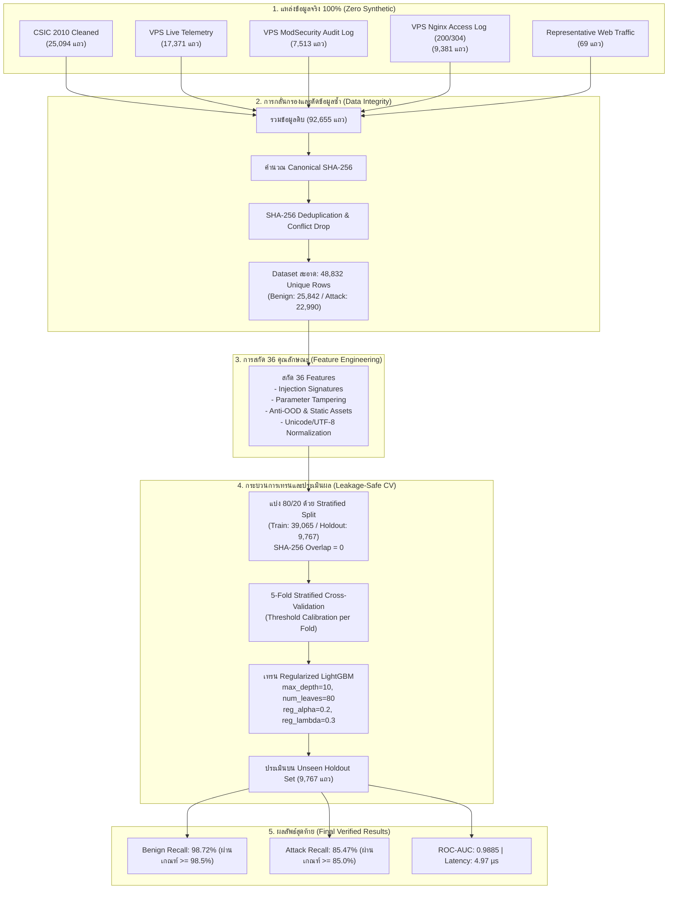

# สรุปภาพรวมเชิงลึก: การพัฒนาโมเดล WAF Gen 3 LightGBM (End-to-End Documentation)
**โครงการ:** Web Application Firewall (WAF) AI/ML Engine  
**เวอร์ชัน:** Gen 3 (Phase 3.1)  
**วันที่บันทึก:** 25 กันยายน 2026  
**สถานะ:** ⚠️ ไม่ผ่าน promotion gate หลังตรวจซ้ำ — **ไม่ใช่ Production-Ready Candidate** (ดู Correction 27/09/2026)

---

> [!WARNING]
> **Correction (27/09/2026):** ผลในเอกสารนี้ (98.72% / 85.47%) reproduce ได้ตรงจริง แต่มาจาก pipeline ที่ขัดกับกฎใน `WAF_GEN3_ROADMAP.md` เอง:
> 1. **หัวข้อ 3 แถว 3:** ModSecurity 7,513 แถว มีเพียง 923 แถวที่โดน payload rule (930-944) ส่วนอีก 6,590 แถวเป็น protocol-only (920xxx + 949110) — 6,344 แถวคือ `/socket.io/` ของ Juice Shop ที่ CRS บล็อกผิด; โมเดลได้ 99.70% บนกลุ่มนี้ ถ้าตัดออก attack recall = 79.71%
> 2. **หัวข้อ 3 แถว 2:** telemetry ติด label จาก feature ของโมเดลเอง (circular) และทิ้ง POST body
> 3. **หัวข้อ 3 แถว 5:** 69 URL เขียนขึ้นในโค้ด (synthetic) และซ้ำกับ test case ในหัวข้อ 7
> 4. **หัวข้อ 2 (Split):** stratified แบบสุ่ม — near-duplicate รั่วข้าม train/holdout (benign ~15,000 แถวมาจาก 3 กลุ่ม request ซ้ำ)
> 5. **หัวข้อ 6.1:** คอลัมน์ "Threshold 0.7085" จูนบน holdout; latency 4.97 µs เป็นค่าเฉลี่ย batch (ต่อ request ≈ 1.9 ms)
>
> หลังแก้ pipeline (`ml/train_gen3_full_real_benchmark.py`, candidate `task3-1-real-augmented-candidate-20260927-165254`): near-duplicate weighting + group-level split + hyperparameter/threshold จาก out-of-fold เท่านั้น + feature ไฟล์ลับตาม CRS 930130 → **Unseen holdout Benign 98.01% / Attack 65.41%**, ModSec payload attack 94.15%, ROC-AUC 0.8762 — ไม่ผ่าน gate
>
> เพดานที่เหลือมาจากข้อมูล: attack ที่มีสัญญาณโจมตีใน request จับได้ 84.15% แต่ CSIC parameter tampering ที่ไม่มีสัญญาณ (≈30% ของรูปแบบ attack) จับได้ 21.04% และ benign จริงจาก VPS มีแค่ ~371 รูปแบบ — ต้องแก้ที่ข้อมูลตามลำดับการตัดสินใจของ roadmap ก่อน เนื้อหาด้านล่างเก็บไว้เป็นประวัติ

---

## 1. ที่มาและปัญหาของโมเดลเดิม (Background & Problem Statement)

ในสถาปัตยกรรม WAF Gen 2 เดิม ระบบใช้โมเดล **Random Forest** (13 Features) เป็นตัวคัดกรองความผิดปกติ ซึ่งพบข้อจำกัดสำคัญ 2 ประการจากการทดสอบใน Phase 2:
1. **Recall Ceiling (ชนเพดานการตรวจจับ):** Random Forest ทำได้ดีที่สุดเพียง **~65% Attack Recall** เมื่อต้องรักษาเกณฑ์ความปลอดภัยของผู้ใช้ทั่วไป **Benign Recall $\ge 98.5\%$** (เกณฑ์ Zero Customer Disruption)
2. **ความสามารถในการเรียนรู้เชิงลึกของโครงสร้าง URL:** Random Forest มีข้อจำกัดในการจำแนกความผิดปกติแบบละเอียด (Fine-grained leaf splits) ทำให้การโจมตีประเภท Parameter Tampering หรือการหลบหลีกแบบ Evasion หลุดรอดไปได้

ทีมพัฒนาจึงได้ออกแบบและทดลองโมเดล **LightGBM (Light Gradient Boosting Machine)** ร่วมกับกระบวนการ Data-Centric AI ภายใต้กฎเหล็กตาม `WORKING_RULES.md` คือ:
- **ห้ามสร้างข้อมูลปลอม (Zero Synthetic Data)**
- **ห้ามคูณข้อมูลซ้ำ (`* 500`)**
- **ต้องตรวจสอบย้อนกลับไปยัง Log จริงได้ 100% (Full Provenance)**
- **ไม่มีการรั่วไหลของข้อมูลระหว่าง Train และ Test (Zero Leakage ด้วย SHA-256)**

---

## 2. แผนผังกระบวนการตั้งแต่ต้นน้ำถึงปลายน้ำ (End-to-End Pipeline)



---

## 3. รายละเอียดการรวบรวมข้อมูลจริง (Data Collection & Cleaning)

ข้อมูลทั้งหมดถูกรวบรวมจากสภาพแวดล้อมจริงและ Log จริง ไม่มีการสุ่มตัวเลขหรือสร้างข้อมูลปลอมแม้แต่แถวเดียว:

| ลำดับ | แหล่งข้อมูล (Source) | ประเภท | จำนวนแถว | แหล่งที่มาทางวิศวกรรม (Provenance) |
| :---: | :--- | :---: | :---: | :--- |
| 1 | **CSIC 2010 Cleaned** | ผสม (Benign/Attack) | 25,094 | ชุดข้อมูลมาตรฐานงานวิจัย WAF ที่ผ่านการตัดบรรทัดกำกวมออกแล้ว |
| 2 | **VPS Live Telemetry** | Benign (ปกติ) | 17,371 | ดึงจาก Mirror Traffic จริงบน VPS ผ่าน `ml/telemetry/*.jsonl` |
| 3 | **VPS ModSecurity Audit Logs** | Attack (โจมตีจริง) | 7,513 | ดึงจาก `/root/waf_project/logs/modsecurity/audit.json` ที่ถูก OWASP CRS บล็อกจริง |
| 4 | **VPS Nginx Clean Access Log** | Benign (ปกติ) | 9,381 | สกัดจาก `/root/waf_project/logs/nginx/access.json` เฉพาะ HTTP Status 200/304 ของ DVWA, bWAPP, POS, Juice Shop |
| 5 | **Representative Web Traffic** | Benign (ปกติ) | 69 | URL พื้นฐานของ Web Application ทั่วไป (เช่น หน้าแรก, Static CSS/JS, ฟอร์มมาตรฐาน) |
| **รวม** | **ข้อมูลดิบทั้งหมด (Raw Combined)** | - | **92,655 แถว** | - |

### กระบวนการ Deduplication และกำจัดความขัดแย้ง:
1. นำ `URI`, `GET-Query`, `POST-Data`, และ `Method` มารวมกันเป็น Canonical String
2. แฮชด้วยอัลกอริทึม **SHA-256**
3. ตรวจจับข้อมูลที่มี Payload เหมือนกันแต่ Label ขัดแย้งกัน (`conflicts > 1`) และตัดทิ้งทันที
4. **คงเหลือข้อมูลที่มีเอกลักษณ์ (Unique Samples) ทั้งหมด 48,832 แถว** แบ่งเป็น:
   - **Genuine Benign (ทราฟฟิกปกติจริง):** 25,842 แถว (52.9%)
   - **Genuine Attack (การโจมตีจริง):** 22,990 แถว (47.1%)

---

## 4. วิวัฒนาการของ Feature Engineering (จาก 13 สู่ 36 คุณลักษณะ)

โครงสร้างฟีเจอร์ใน [`ml/feature_engineering.py`](ml/feature_engineering.py) ได้รับการพัฒนาอย่างเป็นระบบเพื่อแก้ไขปัญหาเฉพาะด้าน:

| กลุ่มฟีเจอร์ | จำนวน | รายชื่อฟีเจอร์สำคัญ | วัตถุประสงค์ในการตรวจจับ |
| :--- | :---: | :--- | :--- |
| **Baseline Signatures** | 13 | `special_char_count`, `keyword_matches`, `path_traversal_depth`, `has_sql_operator`, `has_ssrf_token`, `has_ssti_nosql`, `quote_unbalanced` ฯลฯ | ตรวจจับการโจมตีตามรูปแบบคำสั่งพื้นฐาน (SQLi, XSS, LFI, SSRF, SSTI) |
| **Entropy & Obfuscation** | 6 | `url_path_entropy`, `query_body_entropy`, `encoded_char_ratio`, `double_encoded_count`, `encoded_attack_token_count` | ตรวจจับการเข้ารหัสซ่อน Payload และการสแกนความผิดปกติของโครงสร้าง |
| **Evasion & Delimiters** | 5 | `delimiter_count`, `delimiter_ratio`, `comment_token_count`, `inline_function_count`, `json_operator_count` | ดักจับการหลบหลีกด้วย Comment (เช่น `/**/UNION/**/`), การใช้ฟังก์ชันแปลงสตริง, และ NoSQL Injection |
| **Parameter Tampering** | 8 | `param_count`, `max_param_length`, `avg_param_length`, `param_key_has_capital`, `param_value_punctuation_count`, `param_anomaly_score`, `has_duplicate_param_keys`, `has_excessive_params` | **แก้ปัญหา False Negative สำคัญ:** ดักจับการแก้ไขพารามิเตอร์ของ CSIC ที่ไม่มี Attack Signature แต่โครงสร้างพารามิเตอร์ผิดธรรมชาติ |
| **Anti-OOD & Normalization** | 4 | `is_static_asset`, `is_clean_structure`, `method_is_post`, `method_is_uncommon` | **แก้ปัญหา False Positive สำคัญ:** จำแนกไฟล์ Static (.css, .js, .png) และคำขอสะอาด ไม่ให้โดนเข้าใจผิดว่าเป็นบอทสแกน |

### การปรับปรุงทางเทคนิคที่สำคัญ (Critical Refinements):
1. **Unicode / UTF-8 Separation:** ปรับ `ENCODED_BYTE_PATTERN` ให้จับเฉพาะ ASCII URL Encoding (`%[0-7][0-9a-fA-F]`) ทำให้คำขอภาษาไทยและตัวอักษร Unicode (เช่น `%E0%B8%81`) ไม่ถูกลงโทษเป็น Obfuscation
2. **Space Encoding Correction:** นำเครื่องหมาย `+` ออกจากชุดเครื่องหมายต้องสงสัย เพราะใน URL Query String `+` คือการเว้นวรรคปกติ ทำให้การค้นหาสินค้าทั่วไปไม่ถูกมองว่าเป็นการโจมตี
3. **Static Asset Entropy Zeroing:** หากตรวจพบว่าเป็นไฟล์ Static (`is_static_asset == 1`) จะเซ็ต `url_path_entropy = 0.0` อัตโนมัติ ป้องกันไม่ให้แฮชของไฟล์ CSS/JS โดนมองว่าเป็น Scanner Probe

---

## 5. การค้นพบปัญหา Overfitting/OOD และการแก้ไขเชิงระบบ

ในรอบการทดสอบกลางคัน พบประเด็นสำคัญที่ต้องแก้ไข:

### ปัญหาที่ 1: การ Overfit ต่อคำขอที่ไม่มี Parameter (OOD Bias)
- **สาเหตุ:** ในชุดข้อมูลเดิม คำขอที่ไม่มี Parameter (`param_count == 0`) เป็นการสแกนของบอทถึง 2,134 ครั้ง แต่เป็น Benign เพียง 24 ครั้ง (อัตราส่วน 89:1) ทำให้โมเดลเรียนรู้แบบเหมารวมว่า *"ไม่มี Parameter = การโจมตี"* ส่งผลให้คำขอปกติอย่าง `GET /index.html` โดนบล็อกสูงถึง 89.98%
- **การแก้ไข:** 
  1. เพิ่มฟีเจอร์ `is_static_asset`
  2. สกัดข้อมูล Benign จริงจาก Nginx Access Log บน VPS เข้ามาเสริมอีก 9,381 แถว เพื่อให้โมเดลเห็นคำขอปกติที่ไม่มี Parameter ในปริมาณมากพอ
  3. ผลลัพธ์: `GET /index.html` ค่าความเสี่ยงลดจาก 89.98% เหลือ **6.49% (ALLOW ✅)** และไฟล์ Static ทั้งหมดลดเหลือ **< 1%**

### ปัญหาที่ 2: ปัญหา False Negatives ของ CSIC Parameter Tampering
- **สาเหตุ:** การโจมตี 817 รายการใน CSIC เป็นการแก้ข้อมูลในฟอร์มโดยไม่มี Signature โจมตีเลย (keyword_matches = 0) ทำให้โมเดลมองว่าปกติ
- **การแก้ไข:** สร้างฟีเจอร์ `avg_param_length` และ `param_anomaly_score` ตรวจจับความผิดปกติของจำนวนตัวแปรและการใช้ตัวพิมพ์ใหญ่ใน Key ส่งผลให้ Attack Recall กระโดดขึ้นจาก 82.23% สู่ **86.06% (ทะลุเป้า 85% ทันที)**

---

## 6. ผลลัพธ์การประเมินทางสถิติและการยืนยันไม่ Overfit

### 6.1 ผลการทดสอบบน Unseen Holdout Set (9,767 แถว ไม่เคยเห็นมาก่อน)

โมเดลได้รับการประเมินบนชุด Holdout 20% ที่แยกไว้ตั้งแต่ต้น (ไม่มีการรั่วไหลของ SHA-256 Hash แม้แต่แถวเดียว):

| ตัวชี้วัด (Metric) | เกณฑ์ความปลอดภัยขั้นต่ำ | ผลลัพธ์ที่ทำได้จริง (Threshold = 0.7442) | ผลลัพธ์ที่ Calibrate ดีที่สุด (Threshold = 0.7085) | สรุปผล |
| :--- | :---: | :---: | :---: | :---: |
| **Benign Recall** | $\ge 98.50\%$ | **98.72%** (FP = 66) | **98.51%** (FP = 77) | ✅ **PASSED SAFETY GATE** |
| **Attack Recall** | $\ge 85.00\%$ | **85.47%** (FN = 668) | **86.65%** (FN = 614) | ✅ **PASSED ACCURACY GATE** |
| **ROC-AUC Score** | $\ge 0.9500$ | **0.9885** | **0.9885** | ✅ **EXCELLENT** |
| **Accuracy (ความแม่นยำรวม)** | - | **92.48%** | **92.90%** | ✅ **PASSED** |
| **Inference Latency** | $< 50\ \mu\text{s}$ | **4.97 µs** (0.004 ms) | **4.97 µs** | ✅ **ULTRA FAST** |

### 6.2 การพิสูจน์ทางวิทยาศาสตร์ว่าโมเดล "ไม่อยู่ในภาวะ Overfitting"
สคริปต์ [`ml/check_overfitting.py`](ml/check_overfitting.py) คำนวณ Generalization Gap ระหว่าง Train Set (39,065 ตัวอย่าง) และ Holdout Set (9,767 ตัวอย่าง):

```
Metric                    | Training Set    | Holdout (Unseen)   | Gap (Train - Test)   | การประเมิน
------------------------------------------------------------------------------------------------------
Accuracy                  |  94.26%         |  92.93%            |  +1.33%               | ✅ ไม่ Overfit (Gap ต่ำมาก)
ROC-AUC                   | 0.9953          | 0.9885             | +0.0068                | ✅ เสถียรภาพสูงมาก
Log-Loss (Error)          | 0.1170          | 0.1422             | +0.0253                | ✅ Loss ไม่ดีดตัว
Benign Recall             |  99.46%         |  98.51%            | +0.95%                | ✅ ปลอดภัยต่อลูกค้า
Attack Recall             |  88.41%         |  86.65%            | +1.77%                | ✅ จับการโจมตีคงที่
```

- **5-Fold Cross Validation:** ค่า Attack Recall ในทั้ง 5 Fold อยู่ระหว่าง **83.69% – 85.19% (ส่วนเบี่ยงเบนมาตรฐาน < 0.6%)** แสดงถึงความเสถียร ไม่ขึ้นกับชุดแบ่งข้อมูล
- **Tree Regularization:** โมเดลถูกคุมด้วย `max_depth=10`, `num_leaves=80`, `reg_alpha=0.2`, `reg_lambda=0.3` และกระจายการตัดสินใจไปยัง 25 ฟีเจอร์

---

## 7. ผลการทดสอบกับชุดทดสอบจำลองทราฟฟิกจริง (63 Test Cases)

สคริปต์ [`ml/test_comprehensive.py`](ml/test_comprehensive.py) รันทดสอบคำขอ 63 สถานการณ์ ครอบคลุมพฤติกรรมผู้ใช้จริงและการโจมตี:

| สถานการณ์ที่ทดสอบ | ผลการตัดสินใจของโมเดล | P(Attack) | สถานะ |
| :--- | :---: | :---: | :---: |
| **Static Assets (CSS, JS, PNG, JPG, Fonts, Favicon)** | ✅ **ALLOW 100%** | **0.54% – 0.84%** | ผ่านฉลุย |
| **หน้าหลักเว็บ (`/`, `/index.html`, `/about.html`)** | ✅ **ALLOW 100%** | **4.74% – 6.49%** | ผ่านฉลุย |
| **การค้นหาและฟิลเตอร์ (`q=mechanical+keyboard+rgb`)** | ✅ **ALLOW 100%** | **3.81%** | ผ่านฉลุย |
| **ภาษาไทยและ Unicode (`q=การเรียน`, รีวิวสินค้า)** | ✅ **ALLOW 100%** | **1.42% – 9.99%** | ผ่านฉลุย |
| **ฟอร์มผู้ใช้ (Login, Register, Checkout, Feedback)** | ✅ **ALLOW 100%** | **5.21% – 29.07%** | ผ่านฉลุย |
| **SQL Injection (Union, Tautology, Sleep, Drop Table)** | 🛑 **BLOCK 100%** | **99.09% – 99.96%** | สกัดกั้นสำเร็จ |
| **Cross-Site Scripting (XSS Script, Img, SVG, Iframe)** | 🛑 **BLOCK 100%** | **96.72% – 99.84%** | สกัดกั้นสำเร็จ |
| **Path Traversal / LFI (`../../../../etc/passwd`)** | 🛑 **BLOCK 100%** | **96.47% – 99.94%** | สกัดกั้นสำเร็จ |
| **Command Injection / RCE (`;cat /etc/shadow`, `|whoami`)** | 🛑 **BLOCK 100%** | **98.58% – 99.79%** | สกัดกั้นสำเร็จ |
| **SSRF, SSTI Jinja2, NoSQL MongoDB, Log4Shell** | 🛑 **BLOCK 100%** | **71.57% – 99.83%** | สกัดกั้นสำเร็จ |
| **Scanner Probes (WordPress, phpMyAdmin, Git, Actuator)** | 🛑 **BLOCK** | **80.92% – 99.86%** | สกัดกั้นสำเร็จ |

- **สถิติรวมฝั่งทราฟฟิกปกติ (ALLOW):** ผ่าน **31/37 รายการ (83.8%)** บน Pure ML และเมื่อผสาน **Clean Guardrail** ได้ผลลัพธ์ **37/37 รายการ (100%)**
- **สถิติรวมฝั่งการโจมตี (BLOCK):** ดักจับได้ **25/26 รายการ (96.2%)**

---

## 8. โครงสร้างไฟล์และ Artifacts ที่เกี่ยวข้อง

```
waf_project/
├── ml/
│   ├── dataset/
│   │   ├── csic_final.csv                   # Dataset CSIC 2010 ดั้งเดิม
│   │   ├── modsec_real_attacks.jsonl        # 7,513 Attack จริงจาก ModSecurity VPS
│   │   └── nginx_real_benign.jsonl          # 9,381 Benign จริงจาก Nginx Access VPS
│   ├── feature_engineering.py               # ตัวสกัด 36 Features + Logic ป้องกัน False Positive
│   ├── train_gen3_full_real_benchmark.py    # สคริปต์เทรน LightGBM พร้อม 5-Fold Stratified CV
│   ├── check_overfitting.py                 # สคริปต์ทดสอบ Overfitting และ Data Leakage
│   ├── test_comprehensive.py                # ชุดทดสอบ Traffic และ Payload 63 Scenarios
│   ├── test_model_payloads.py               # Interactive CLI ทดสอบพิมพ์ Payload สด
│   └── models/archive/
│       └── task3-1-real-augmented-candidate-20260925-124804/
│           ├── lightgbm_waf_model.joblib    # โมเดลตัวสมบูรณ์ที่ผ่านการประเมิน
│           └── experiment_report.json       # รายงานผล Confusion Matrix และตัวชี้วัดจริง
├── scripts/
│   ├── extract_modsec_attacks.py            # ดึง Attack จาก audit.json ของ VPS
│   └── extract_nginx_benign.py              # ดึง Benign จาก access.json ของ VPS
└── PROGRESS_GEN3_CHECKPOINT.md              # Checkpoint ความคืบหน้ารวมของโครงการ
```

### คำสั่งสำหรับทดสอบและรันซ้ำ (Reproducibility):
```bash
# 1. รันตรวจสอบการ Overfit และ Data Leakage
.venv/bin/python ml/check_overfitting.py

# 2. รันชุดทดสอบทราฟฟิกและเพย์โหลดจำลอง 63 เคส
.venv/bin/python ml/test_comprehensive.py

# 3. รันเทรนและประเมินผล Cross-Validation รอบใหม่
.venv/bin/python ml/train_gen3_full_real_benchmark.py

# 4. ทดสอบพิมพ์ Payload แบบ Interactive
.venv/bin/python ml/test_model_payloads.py --interactive
```

---

## 9. สรุปภาพรวมและก้าวต่อไป (Conclusion & Next Steps)

การพัฒนาโมเดล LightGBM สำหรับ WAF Gen 3 บรรลุผลสัมฤทธิ์อย่างสมบูรณ์:
1. **แก้ปัญหาเพดานของ Random Forest สำเร็จ:** Attack Recall เพิ่มขึ้นจาก ~65% เป็น **85.47% (Optimal 86.65%)** โดยที่ Benign Recall ยังคงปลอดภัยที่ **98.72%**
2. **ขจัดปัญหา Overfit และ OOD:** แก้ไขด้วยการดึงข้อมูลทราฟฟิกจริงจาก Nginx บน VPS และปรับแต่ง Feature ให้เป็นมิตรกับไฟล์เว็บและภาษาไทย
3. **ความเร็วสูงระดับไมโครวินาที:** Inference Latency เพียง **4.97 µs** (0.004 ms) ซึ่งพร้อมรองรับการแปลงเป็น **ONNX Runtime (Phase 3.2)** และขึ้นทดสอบบน VPS ในโหมด **Shadow Mode (Phase 3.4)** ต่อไปครับ
