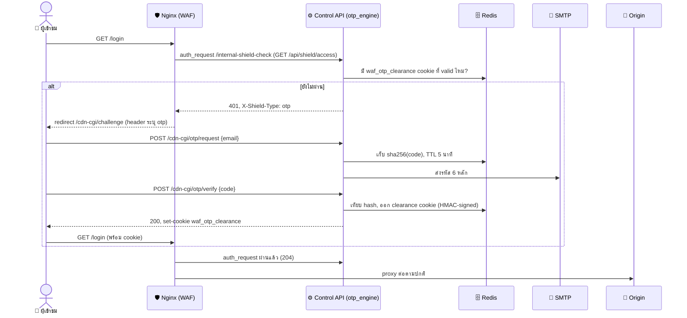

# OTP Shield — Opt-in Email Verification Gate for Origin Login Pages

> **หัวใจหลัก:** ปกป้อง login path ของ origin ด้วยรหัสผ่านครั้งเดียว (OTP) ที่ส่งไปยังอีเมลของ *ผู้เข้าชมเอง* — โดยไม่แตะโค้ด origin แม้แต่บรรทัดเดียว (Zero-Touch Origin Principle เดิม) เปิด/ปิดได้ต่อ origin จาก Dashboard, ปิดเป็นค่าเริ่มต้นเสมอ

---

## 1. นี่คือ "ยืนยันความเป็นคน" ไม่ใช่ 2FA จริง

WAF ไม่มีสิทธิ์เข้าถึงฐานข้อมูล user ของ origin (Zero-Touch Origin Principle) จึงไม่รู้จัก "บัญชีจริง" ของใครเลย — ผู้เข้าชมเป็นคนกรอกอีเมลของตัวเองที่หน้าด่าน ระบบส่งรหัสไปให้ พิสูจน์แค่ว่า "มีคนจริงที่เข้าถึงกล่องอีเมลนั้นได้" ก่อนจะปล่อยผ่านไปหน้า login จริงของ origin — เป็นชั้นความปลอดภัยเดียวกับ CAPTCHA Shield ที่มีอยู่แล้ว (`a3edfab`) แค่ proof คนละแบบ (อีเมลจริง แทน PoW puzzle)

## 2. สถาปัตยกรรม — สร้างต่อจาก CAPTCHA Shield ทั้งหมด ไม่ใช่ของใหม่

| ส่วน | CAPTCHA Shield (มีอยู่แล้ว) | OTP Shield (ใหม่) |
|---|---|---|
| Config store | `dashboard/backend/services/captcha_config.py` (Redis, per-origin+per-domain) | `otp_config.py` — โครงเดียวกันทุกฟังก์ชัน |
| Dashboard API | `GET/PUT /api/origins/{id}/captcha` | `GET/PUT /api/origins/{id}/otp` |
| Challenge engine | `cdn/control-api/captcha_engine.py` | `otp_engine.py` — ใช้ helper ร่วมกัน (`normalize_host`, `client_ip`, `subnet_identity`) |
| Clearance cookie | `waf_clearance` | `waf_otp_clearance` (**แยกคุกกี้** — เปิดทั้งสองระบบพร้อมกันได้ ไม่ล้างกันเอง) |
| Nginx gate | `internal-shield-check` → 401 (`X-Shield-Type: captcha`) → `/cdn-cgi/challenge` | `internal-shield-check` → 401 (`X-Shield-Type: otp`) → `/cdn-cgi/challenge` |

### ทำไมทั้งสอง gate ใช้ status 401 ร่วมกัน (ไม่ใช่ 403, ไม่ใช่ 418)
ModSecurity เองก็ตอบ 403 อยู่แล้วเวลาบล็อก (`deny,status:403`) ถ้า OTP gate ใช้ 403 ด้วย `error_page 403` ระดับ server จะไป**สลับหน้าบล็อกของ WAF จริงให้กลายเป็นหน้ากรอกอีเมลแทน** — ช่องโหว่เชิง correctness ที่ตรวจพบและแก้ก่อน deploy

ลองใช้ 418 (คนละ status กับ captcha) ในตอนแรก แต่พบตอน E2E test ว่า `nginx: auth request unexpected status: 418` — โมดูล `ngx_http_auth_request_module` ของ nginx **รู้จักแค่ 401/403** เป็น "deny status" ที่ map ผ่าน `error_page` ได้ status code อื่นถือเป็น upstream error จริง แล้วตอบ 500 กลับไปหา client แทน (ไม่ redirect) เพราะ 403 ถูกจองไว้แล้ว (ModSecurity) เหลือแค่ 401 ที่ใช้ได้จริง — วิธีแก้: รวม captcha+OTP เป็น **ด่านเดียว** (`GET /api/shield/access` ใน `otp_engine.shield_access`) ที่เช็คทั้งสองอย่างแล้วตอบ 401 พร้อม header `X-Shield-Type: captcha|otp` บอก nginx (ผ่าน `auth_request_set` แล้ว forward เป็น request header) ว่าด่านไหนที่ fail — หน้า `/cdn-cgi/challenge` เดียวอ่าน header นี้แล้วเลือก render หน้า captcha หรือ otp ให้ถูกต้อง นี่คือเหตุผลที่ทั้งสอง shield "compose" กันได้บน origin เดียวกันจริง ๆ (ไม่ใช่แค่ cookie คนละชื่อ — สถานะ gate ก็แยกกันจริงในระดับ nginx ด้วย)

## 3. Request Lifecycle

## 4. Abuse mitigation

- **Request rate limit**: 3 ครั้ง/10 นาที ต่อ (client IP + email hash) — กัน endpoint ถูกใช้เป็น spam relay ยิงอีเมลไปหาคนอื่นที่ไม่เกี่ยวข้อง
- **Verify attempt limit**: 5 ครั้งต่อ challenge_id ก่อนถูกลบทิ้ง
- **Context binding**: challenge ผูกกับ IP subnet + User-Agent digest ตอน request เทียบซ้ำตอน verify — ขโมย challenge_id ไปใช้เครื่องอื่นไม่ได้
- **Code TTL**: 5 นาที (ปรับได้ 60–900 วิ ต่อ origin)

## 5. ข้อจำกัดที่ต้องรู้

- **ยังไม่มี SMTP account จริง** — `cdn/control-api/email_sender.py` จะ fail แบบ log ชัดเจน (`SMTP_HOST/USER/PASS/FROM not configured`) ไม่ใช่แกล้งว่าส่งสำเร็จ ต้องตั้ง `SMTP_HOST/PORT/USER/PASS/FROM` ใน `.env` ก่อนถึงจะส่งอีเมลจริงได้ (ดู `.env.example`)
- **ไม่ใช่ per-account 2FA จริง** — เป็น human-verification เท่านั้น ใครก็กรอกอีเมลอะไรก็ได้ที่ตัวเองเข้าถึงได้ ไม่ผูกกับ user account ของ origin
- **channel รองรับแค่ email ตอนนี้** — schema เผื่อ `channel` field ไว้แล้ว เพิ่ม provider อื่นทีหลังไม่ต้องแก้ schema

## 6. ไฟล์ที่แก้/เพิ่ม

- `dashboard/backend/services/otp_config.py` (ใหม่)
- `dashboard/backend/api/origins.py` (เพิ่ม `OtpShieldConfig` + 2 endpoints)
- `cdn/control-api/email_sender.py`, `otp_engine.py` (ใหม่)
- `cdn/control-api/main.py` (mount routes)
- `cdn/control-api/requirements.txt` (+ `email-validator`)
- `nginx/includes/otp_server.conf` (ใหม่), `nginx/templates/conf.d/default.conf.template` (wire include + auth_request)
- `docker-compose.yml`, `.env.example` (SMTP env vars)
- `dashboard/frontend/src/pages/OriginDetail.tsx` (toggle UI ในแท็บ Bot & Login Shield เดิม)
